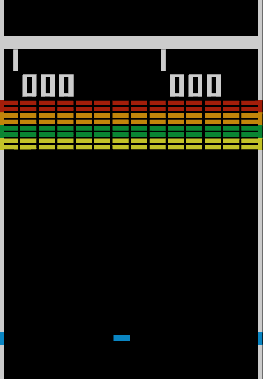
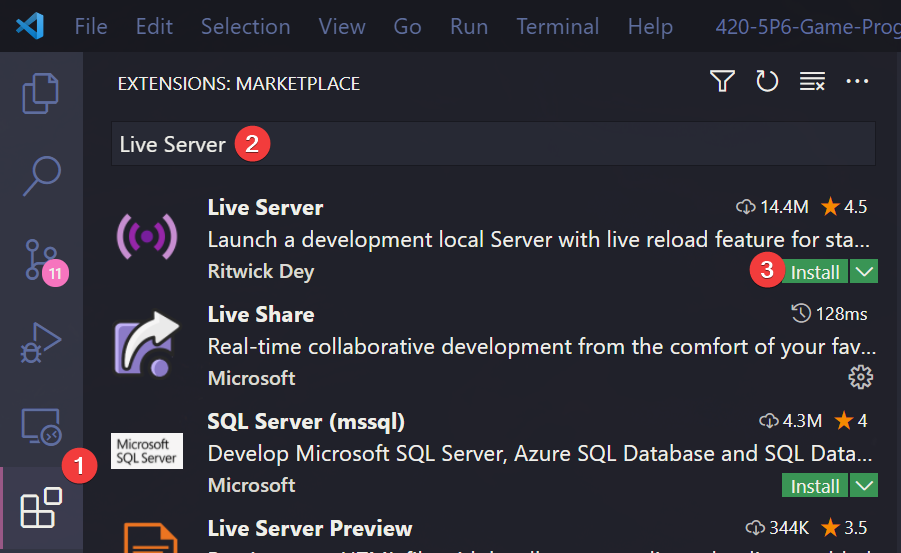
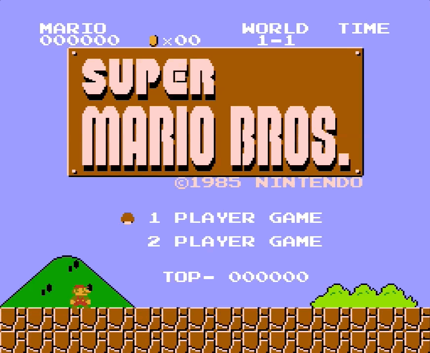
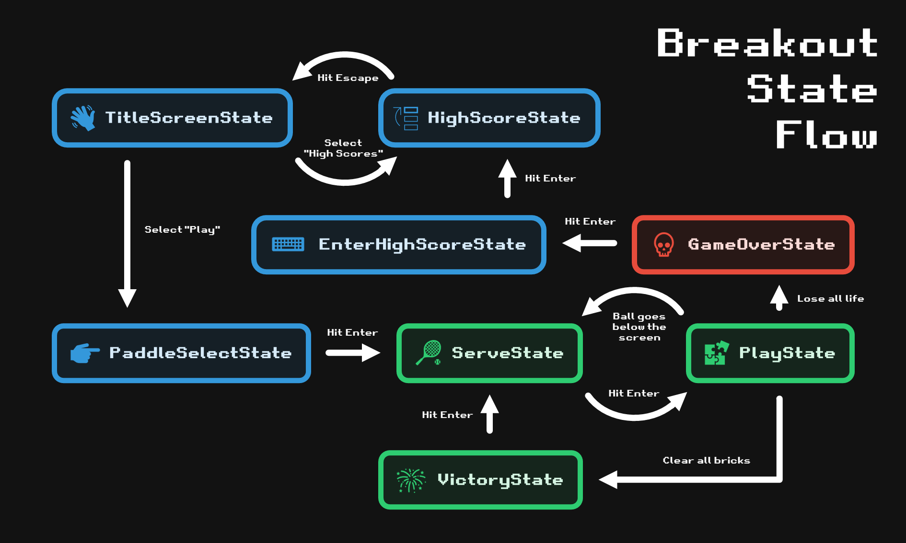
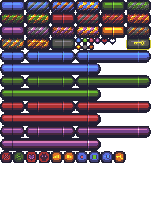

# 🧱 Breakout

## 🎯 Objectives

- **Images (Sprites)**: How can we load images from memory to our game and draw them on the screen?
- **Sprite Sheets**: Allows us to condense all the images we need to load for our game into one big image, with each sprite assigned a specific area in the sheet.
- **State Machines**: Last week we used a rudimentary "state machine" for pong, which was really just a string variable and a few if statements in our love.update() function. This week we'll see how we can actually use a state machine class to allow us to transition in and out of different states more cleanly, and abstract this logic away from our main.js file and into separate classes.
- **Procedural Layouts**: We'll take a look at how to dynamically generate bricks layouts so that no two levels are the same.
- **Levels**: We'll introduce the concept of "levels" to our game, allowing a player to progress and change what we're displaying to the screen accordingly.
- **Mouse Input**: Last week we worked with keyboard input for Pong, and this week we'll see how to process mouse input.
- **Player Health**: We'll learn how to keep track of player "health" using hearts to give them a number of chances before losing the game.
- **Collision Detection Revisited**: Collision detection will be a bit more advanced this week.
- **Persistent Save Data**: In the context of high scores, it's useful to know how to save information relevant to our game so that the next time we open it, we can still access that old information.
- **Music**: Similarly to how we added sound effects to our game last week, we'll see how to add music to our game this week and ensure that it loops during game execution.
- **Particle Systems**: We'll learn more about particle systems this week to provide more aesthetically pleasing qualities to our game.

Originally developed by Atari in 1976. An effective evolution of Pong, Breakout ditched the two-player mechanic in favor of a single-player game where the player, still controlling a paddle, was tasked with eliminating a screen full of differently placed bricks of varying values by deflecting a ball back at them.



_Image from [Wikipedia](https://en.wikipedia.org/wiki/Breakout_(video_game))_

## 🔨 Setup

1. Clone the repo (or download the zip) for today's lecture, which you can find [here](https://github.com/JAC-CS-Game-Programming-Fall22/1-Breakout).
2. Open the repo in Visual Studio Code.
3. Start Visual Studio Code's "Live Server" extension. If you don't have it installed:
   1. Click on the extensions icons in the left-hand side navigation.
   2. Search for "Live Server".
   3. Click install next to the extension by "Ritwick Dey". You may have to reload the window.

      

   4. Once it's installed, click "Go Live" on the bottom right of the window. This should start the server and automatically open a new tab in your browser at `http://127.0.0.1:5500/` (or whatever port it says on your machine).
      - The files the server serves will be relative to the directory you had open in VSC when you hit "Go Live".

## 🌅 Breakout-0 (The "Day-0" Update)

Breakout-0 displays the title screen and allows the user to toggle between the "Start" and "High Score" options.

### State Machines

A **state machine** is a mechanism through which we handle the different "screens" (i.e. states) of our game. When you start your favourite game, you're usually not thrown right into the game itself. Rather, you're presented with a [title screen](https://www.youtube.com/watch?v=pi47bBT4G9Q) that gives you a menu with options. When you select one of those options, you're taken to a different "screen" in the game.



_An example of one of the most well known title screens from [Super Mario Bros.](https://en.wikipedia.org/wiki/Super_Mario_Bros.)_

Here's the state diagram we're going to use for the final version of Breakout:



- The program will begin in `TitleScreenState`, which can transition back and forth between itself and `HighScoreState` (since the user can check high scores before playing).
- `TitleScreenState` can also transition to `PaddleSelectState`, which transitions on to `ServeState`.
- During gameplay, the program will transition back and forth between `ServeState` and `PlayState` as the user loses health. If the user clears the level, the program transitions onto the `VictoryState` and then to the `ServeState` for the next level.
- Alternatively, if the user loses all their lives before clearing the level, the program will transition from `PlayState` to `GameOverState`, optionally transitioning to the `EnterHighScoreState` (if the user achieves a high score) and then on to the `HighScoreState`, or transitioning from `GameOverState` to `TitleScreenState` if the user does not have a high score.

### Important Code

- We will manage all our game states using an overarching `StateMachine.js` class, which handles the logic for initializing and transitioning between them.
- `State.js` is an abstract base class for the other states - it defines empty methods and passes them on to its children via [inheritance](https://www.youtube.com/watch?v=ajOYOxCanhE).
- In `globals.js` we define our state machine and in `main.js` we populate it with states. The last state added is always set as the current state.
- Currently in the `src/states` directory, we only have `TitleScreenState.js`:
  - `update()`: Allows the user to toggle between "Start" and "High Scores" on the screen, highlighting their selection and playing a toggle sound effect.
  - `render()`: Includes some graphics configurations specific to the `TitleScreenState`.
- Also in `globals.js`, we initialize our `sounds` object. Notice that instead of declaring `new Audio()` objects like we did last week, we're now declaring `new SoundPool()` objects. If you take a look in `SoundPool.js`, you'll find a class that takes care of keeping an array (i.e. "pool") of sounds. The reason this is necessary is so that we can have multiple of the same sound play even when that sound is currently playing.
  - To see this in action, uncomment line 21 in `globals.js` and comment line 22. In the browser, hold down either `w` or `s` and notice that the sound only starts to play again when the previous iteration of the sound is done. This is why we need a pool of sounds!
- Finally in `globals.js`, we initialize our `images` object. Notice that instead of declaring `new Image()` objects, we're declaring `new Graphic()` objects. If you take a look in `Graphic.js`, you'll find a class that takes care of wrapping the JS image API. One advantage of doing this is so that we can declare our image's size and source at the same time, instead of doing it separately.
- **Be sure to read through each file carefully so as to understand its role in the overarching project.** The code itself should look familiar, but do take the time to familiarize yourself with the organizational layout.

## 👾 Breakout-1 (The "Sprite" Update)

Breakout-1 takes advantage of "sprite sheets" in order to render a paddle sprite during `PlayState`.

### What is a Sprite Sheet?

A Sprite Sheet is essentially an image containing smaller images (i.e. "sprites") within itself. A sprite sheet can be split into "sprites", that is, rectangular sections of itself (each encapsulating a single sprite), so that instead of having multiple image files in our project for each sprite, we can more efficiently use a single file that we section out into sprites when rendering a particular sprite.



### Important Functions

- `SpriteManager.generatePaddleSprites()`
  - This function extracts the paddle sprites from the main sprite sheet.
- `Sprite::render(x, y)`
  - The sprite object contains the `x` and `y` coordinates of **where the sprite is located in the sprite sheet image**. The `x` and `y` that we pass to this render function is the **location we want to draw the sprite on the canvas**.

### Important Code

- `Paddle.js`
  - Contains all the updating and rendering logic for our paddle.
- `PlayState.js`
  - `update()` allows the user to pause the game and move the paddle.
  - `render()` calls the paddle's own `render()` method and also displays paused text if `this.paused` is true.

## ⛹️‍♀️ Breakout-2 (The "Bounce" Update)

Breakout-2 uses AABB Collision Detection so that the ball can bounce when it collides with the paddle or the walls.

### Important Code

- In `SpriteManager.js` you'll notice that we've added a method to extract the ball sprites from the sprite sheet.
  - In this function, we're finding the offset for our ball sprites in our sprite sheet and looping over it, generating `Sprite` objects for the balls as we go. This is essentially the same function for how we extracted our paddle sprites.
- Read through `Ball.js`, which creates our `Ball` class:
  - `constructor()` initializes the ball's position, size, velocity, colour and sprites.
  - `didCollide()` checks for collisions using AABB Collision Detection.
  - `reset()` resets the ball to the middle of the screen.
  - `update()` implements behavior for bouncing off walls.
  - `render()` renders the ball to the screen.
- Again, we conclude with some additions to `PlayState.js`:
  - `constructor()` now instantiates a ball.
  - `update()` calls the ball's update method and naively implements behavior for bouncing off the paddle. Can you think of a potential issue with our implementation? (Hint: think about what else we might want to do besides reversing the ball's velocity). You might be able to observe the issue by trying to bounce the ball off the paddle at an angle.
  - `render()` calls the ball's `render()` method.

## 🧱 Breakout-3 (The "Brick" Update)

Breakout-3 renders bricks onto the screen. It implements bouncing behavior for the ball upon a collision with a brick. It also fixes our previous naive implementation of bouncing behavior between the ball and the paddle.

### Important Algorithms

We want the player to control the trajectory of the ball based on where it hits the paddle. If the ball hits the center of the paddle, the ball should slow down and have a steeper angle. If the ball hits more towards the edges of the paddle, the ball should speed up and have a shallower angle. The code for this is explained in the next section.

For brick collision, we must check which edge of the ball is not inside the brick:

```pseudocode
if left edge of ball is outside brick and dx is positive:
    trigger left-side collision
else if right edge of ball is outside brick and dx is negative:
    trigger right-side collision
else if top edge of ball is outside brick:
    trigger top-side collision
else
    trigger bottom-side collision
```

This is a fairly simple collision algorithm, so it is not the most accurate, particularly when faced with corner-cases, but it works essentially 99% of the time. For a more robust solution, [check out this alternative method](https://github.com/noooway/love2d_arkanoid_tutorial/wiki/Resolving-Collisions).

### Important Code

- In `SpriteManager.js` you'll notice that we've added another method, `generateBallSprites()`, to extract the brick sprites from the sprite sheet.
- `Brick.js` creates our brick class:
  - `constructor()` initializes a brick. Importantly, we include an `inPlay` flag to serve as a signal for whether a brick is still in play or if it should disappear from the screen. In the context of this Breakout game, this is an effective shortcut, but do note that in larger programs, it would be better practice to free memory that is not being used instead of just hiding it from view.
  - `hit()` hides a brick by toggling the `inPlay` flag to `false`.
  - `render()` renders a brick to the screen.
- `PlayState.js` references a new class, `LevelMaker.js`, which encapsulates all the logic for generating new levels (i.e. different layouts for the bricks). It also checks for collisions between the ball and the bricks, hiding bricks as needed, and renders the "in play" bricks to the screen.
- To create a level, `LevelMaker.js` randomly generates an array of bricks that can be rendered to the screen. Read through the `LevelMaker.createMap()` function carefully.
- In `Ball.js`, we've added an `handlePaddleCollision()` function to reflect the collision algorithms mentioned above:

    ```javascript
    const paddleBallDistance = paddle.x + paddle.width / 2 - this.x;
    const scaleFactor = 8;
    const minimumVelocity = 50;

    if (this.x < paddle.x + (paddle.width / 2) && paddle.dx < 0) {
        this.dx = -minimumVelocity + -(scaleFactor * paddleBallDistance);
    }
    else if (this.x > paddle.x + (paddle.width / 2) && paddle.dx > 0) {
        this.dx = minimumVelocity + (scaleFactor * Math.abs(paddleBallDistance));
    }
    ```

  - First, we calculate the distance between the paddle and the ball to scale the ball's `dx`.
  - `scaleFactor` and `minimumVelocity` are values that are used to control the ball's `dx` depending on where it hit the paddle.
  - Then perform this operation on either side of the paddle based on the paddle's `dx`. If on the right side, the differential will be negative, so we need to call `Math.abs()` to make it positive, then scale it by a positive amount so `dx` becomes positive.

- And below that, we've added a `handleBrickCollision()` function based on the pseudocode in the section above. We slightly increase the ball's velocity after a collision:

    ```javascript
    if (this.x < brick.x && this.dx > 0) {
        this.dx = -this.dx;
    }
    else if (this.x > brick.x + brick.width && this.dx < 0) {
        this.dx = -this.dx;
    }
    else if (this.y < brick.y) {
        this.dy = -this.dy;
    }
    else {
        this.dy = -this.dy;
    }

    this.dy *= 1.02;
    ```

## 💜 Breakout-4 (The "Hearts" Update)

Breakout-4 implements the idea of "health" for the user, which is displayed on the screen as hearts.

### Important Code

- Notice that in `TitleScreenState.js`, when we transition to `ServeState`, we are passing along paddle, bricks, health, and score through `stateMachine:change()`. This design is cleaner since it allows us to remove unnecessary values from our files. For example, it makes sense to have a paddle and bricks when we are in `ServeState`, but not so much when we are in `HighScoreState`.
- On that note, take a look at `ServeState.js`, which serves (😜) a very similar purpose to the `ServeState` from Pong. The code should look familiar, as all we're doing here is providing a state in which the user can hit the enter key to transition to the `PlayState`.
- In `globals.js` you'll notice we've added hearts to our `images` object. This is used in the new `UserInterface` class for rendering the user's health on the screen. It simply draws the corresponding number of full hearts followed by empty hearts per the user's health.

    ```javascript
    // UserInterface.js
    let healthX = CANVAS_WIDTH - 130;
    const sprites = SpriteManager.generateHeartSprites();

    for (let i = 0; i < this.health; i++) {
        sprites[0].render(healthX, 12);
        healthX = healthX + 11;
    }

    for (let i = 0; i < 3 - this.health; i++) {
        sprites[1].render(healthX, 12);
        healthX = healthX + 11;
    }
    ```

- `PlayState.js` now also takes care of keeping score, monitoring the user's health, and transitioning to other States as needed. You should be able to find the health-tracking code in `PlayState::update()`, which simply decreases health and reverts to `ServeState` when the ball goes past the paddle beyond the bottom of the screen:

    ```javascript
    if (this.ball.didFall()) {
        this.health--;
        sounds.hurt.play();

        if (this.health === 0) {
            stateMachine.change('game-over', {
                score: this.score,
            });
        }
        else {
            stateMachine.change('serve', {
                paddle: this.paddle,
                ball: this.ball,
                bricks: this.bricks,
                health: this.health,
                score: this.score,
                userInterface: this.userInterface,
            });
        }
    }
    ```

- The score tracking can also be found in `PlayState::update()`, where we simply add 10 points to the score every time a ball/brick collision is detected.
- `GameOverState.js`, which is unsurprisingly called when the user loses all health, simply renders a "Game Over" screen with the final score. When a user presses the enter key in this state, they're taken back to the `TitleScreenState`.

## ⏩ Breakout-5 (The "Progression" Update)

Breakout-5 updates the levels to include different colours and layouts of bricks. The player can now beat a level and progress to the next. We also now differentiate between the different tiers of bricks, making updates to the gameplay and the scoring as a result.

### Important Code

- We've made a few modifications to `LevelMaker.js` in order to allow for a more varied gaming experience.
  - The changes mostly consist of adding some new flags so that we can display different colours and layouts for our bricks.
  - Read through the changes to this file carefully, paying special attention to the comments, to understand how we are generating our new brick layouts.
- Take a look at `Brick.js`. You'll notice that we've updated the `hit()` method such that it only toggles the `inPlay` flag if the brick being hit is of the lowest tier. Otherwise, it simply decrements the tier of the brick.

    ```javascript
    // Brick.js
    if (this.tier > 0) {
        this.tier--;
    }
    else {
        this.inPlay = false;
    }
    ```

  - The tier of the brick just means how many hits that brick will take to break.

- We also use the tier to calculate which brick sprite to render:

    ```javascript
    // Brick.js
    this.sprites[this.colour * (this.numberOfColours - 1) + this.tier].render(this.x, this.y);
    ```

- In `PlayState.js`, we've updated the scoring algorithm to attribute higher values to bricks of higher tiers. Whereas previously we always added 10 points for any ball/brick collision, we now take tier into account:

    ```javascript
    // PlayState.js
    this.score += this.baseScore * (brick.tier + 1);
    ```

- You'll notice in `TitleScreen.js` that we are now passing in an additional field to `ServeState` upon transition, namely, `level`.
  - We'll continue to do this once each level has been beaten, incrementing level as needed.
  - In `PlayState.js`, we've written a new method, `checkVictory()`, that checks if the current level has been beaten, by checking if every brick's `inPlay` flag has been toggled to `false`.
  - This method is called within `Playstate::update()`, since it makes sense to check if the level has been beaten each time a brick is hit.
- `VictoryState.js` contains the code for producing our victory screen. It is only ever activated when the user beats a level. This is also where we increment the value of `level`. Upon increasing the level, we must generate a new brick layout:

    ```javascript
    // VictoryState.js
    stateMachine.change('serve', {
        ball: this.ball,
        bricks: LevelMaker.createMap(this.level + 1),
        paddle: this.paddle,
        health: this.health,
        score: this.score,
        userInterface: this.userInterface,
        level: this.level + 1,
    });
    ```

  - Notice that we're also passing the incremented level into `LevelMaker.createMap()` so that we can get higher tier bricks on higher levels.

## 🎉 Breakout-6 (The "High Score" Update)

Breakout-6 introduces the ability to add and view high scores. For our storage mechanism, since we're in the browser, we can use local storage. Local storage is a simple way to store small key/value pairs (kind of like cookies) for a particular domain on your browser. [Read more about local storage here](https://developer.mozilla.org/en-US/docs/Web/API/Window/localStorage).

### Important Functions

- `localStorage.getItem(key)`
  - Gets a key/value pair from the browser's local storage by the key.
- `localStorage.setItem(key, value)`
  - Sets a key/value pair to the browser's local storage with the provided key and value.
- `JSON.parse(string)`
  - Takes a string containing valid JSON and converts it to a JavaScript object.
- `JSON.stringify(object)`
  - Takes a JavaScript object and converts it to a string containing valid JSON.

### Important Code

- In `HighScoreManager.js`, we have two new functions:
  - `loadHighScores()`: Loads existing high scores from the browser's local storage.
    - If the key doesn't exist, we create it and fill it with 10 placeholder names and scores.
  - `addHighScore()`: Adds a new high score to the browser's local storage.
- These functions are used by `HighScoreState`, `GameOverState`, and `EnterHighScoreState`, so have a look at those three files and make sure you understand how the high scores are being handled.
- In `EnterHighScoreState.js`, we allow users to enter their high scores by choosing a 3-character name. The name is selected by toggling the 3 characters using the `w`, `a`, `s`, `d` keys. We use ASCII values to implement this behavior.
  - Once the user settles on a name, we write their score to local storage using `HighScoreManager`, taking care to only store the top 10 scores.

## 🏓 Breakout-7 (The "Paddle Select" Update)

Breakout-7 introduces a new state that allows the user to select a paddle skin before starting the game.

### Important Code

- In `PaddleSelectState.js`, we render a new screen to the user which contains some text, a left arrow, a right arrow, and a paddle.
- The user can toggle between paddles using `a` and `d` and can make a selection by pressing enter.
- Notice that this state is now in charge of transitioning over to `ServeState` and passing along the relevant values instead of `TitleScreenState`.

## ✨ Breakout-8 (The "Polish" Update)

Breakout-8 implements a rudimentary particle system to create a nicer visual effect when the ball collides with a brick. For a fantastic introduction to particles, [please watch this video from The Coding Train](https://youtu.be/syR0klfncCk). As the final update, we're also adding music.

### Important Code

- In `Particle.js` we define a class that represents one tiny particle in the game. Each particle has its own position, velocity, and acceleration. We can manipulate these values to achieve a little "explosion" effect in the game when a brick is hit.
- In the `constructor()` of `Brick.js`, we define a new array of `particles` that will be populated in `hit()` and a `colours` array of RGB values corresponding to the blue, green, red, purple, and gold colours of our bricks from the sprite sheet.
  - In `hit()`, we then use `colours` to set the colour when instantiating new particle objects.
  - In `update()` and `render()`, we make sure every particle gets updated and drawn to the screen according to each particle's individual `life` value.
  - Make sure to now call `brick.update(dt)` in `PlayState.js`!
- Finally, we add some music to the game in `globals.js` by adding the music track to our `sounds` object (notice the `true` for looping) and calling `sounds.music.play()` in `Game::start()`.

And with that, we have a fully functioning game of Breakout!

## 📚 References

- [Harvard's CS50 Introduction to Game Development - Breakout](https://cs50.harvard.edu/games/2018/notes/2/)
- [Particle Systems - The Coding Train](https://youtu.be/syR0klfncCk)
- [The Art of Video Game Title Screens - NakeyJakey](https://www.youtube.com/watch?v=pi47bBT4G9Q)
