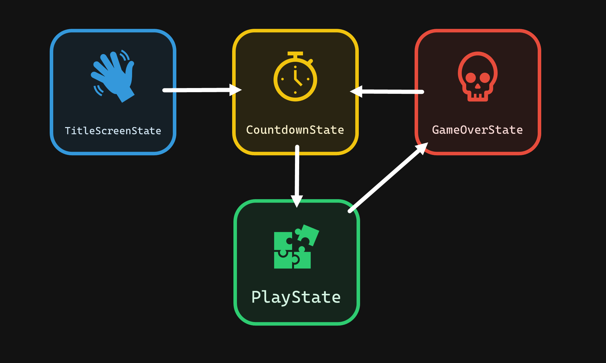

# 🐤 Flappy Bird

## 🎯 Objectives

- **Images (Sprites)**: How can we load images from memory to our game and draw them on the screen?
- **Infinite Scrolling**: How can we make our game map appear to scroll infinitely from left to right without using all our memory?
- **"Games Are Illusions"**: We'll see how camera trickery is often the crucial piece for bringing games to life.
- **Procedural Generation**: Going hand in hand with infinite scrolling, we'll learn how to use procedural generation to draw additional sprites (such as the pipes in Flappy Bird) to the screen as our game map scrolls from left to right.
- **State Machines**: Last week we used a rudimentary "state machine" for pong, which was really just a string variable and a few if statements in our love.update() function. This week we'll see how we can actually use a state machine class to allow us to transition in and out of different states more cleanly, and abstract this logic away from our main.js file and into separate classes.
- **Mouse Input**: Last week we worked with keyboard input for pong, and this week we'll see how to process mouse input for Flappy!
- **Music**: Similarly to how we added sound effects to our game last week, we'll see how to add music to our game this week and ensure that it loops during game execution.

Flappy Bird is a mobile game by Dong Nguyen that went viral in 2013, utilizing a very simple but effective gameplay mechanic of avoiding pipes indefinitely by tapping the screen, making the player's bird avatar flap its wings and move upwards slightly. It's a variant of popular games like "Helicopter Game" that floated around the internet for years prior. This game illustrates some of the most basic procedural generation of game levels possible as by having pipes stick out of the ground by varying amounts, acting as an infinitely generated obstacle course for the player.


_Image courtesy of [MacRumors](https://www.macrumors.com/2014/02/08/flappy-bird-removal/)_

## 🔨 Setup

1. Clone the repo (or download the zip) for today's lecture, which you can find [here](https://github.com/JAC-CS-Game-Programming-F21/1-Flappy-Bird).
2. Open the repo in Visual Studio Code.
3. Open the VSC terminal (`` CTRL + ` ``) and run `npx http-server` (assuming you have NodeJS installed, if you don't, [download and install it from here](https://nodejs.org)) inside the root folder of the repo.
4. In your browser, navigate to `http://localhost:8080` (or whatever the URL is that is displayed in the terminal).

## 🌅 Flappy-Bird-0 ("The Day-0 Update")

Flappy-Bird-0 simply draws two images to the screen - a foreground and a background.

### Important Functions

- `new Image(width, height)`
  - This function creates a new `Image` object with the specified width and height. To set the image source from a graphics file (JPEG, PNG, GIF, etc.), assign a string containing the path to the image file to the `Image`'s `.src` property.
- `context.drawImage(image, x, y, width, height)`
  - This function draws an image to the screen at a given `x` and `y` on our 2D coordinate system. Recall that last week we used `context.fillRect()` to draw our paddles and ball. This time, we'll want to draw actual images, so we'll be using this function.

### Important Code

> 💡 Notice we've encapsulated our core game engine logic into a dedicated `Game.js` class as well as declared a `globals.js` file for any variables/constants that will be required throughout our game.

!> Be extremely cautious when adding things to `globals.js` since it can easily become bad practice. Always ask yourself before adding something to this file: "does this **NEED** to potentially be available _anywhere_ throughout my codebase?". If the answer is no, think of how you can pass that value internally in your code.

You should be able to recognize most of the code in this update from last week aside from a new `images` variable:

```javascript
export const images = {
    background: new Image(1157, 288),
    ground: new Image(1100, 16),
};

images.background.src = "./images/background.png";
images.ground.src = "./images/ground.png";
```

Here we are defining an object which has two properties that contain image objects for our background and our ground. This will come into play shortly.

Take a look at `render()`:

```javascript
context.drawImage(images.background, 0, 0, images.background.width, images.background.height);
context.drawImage(images.ground, 0, CANVAS_HEIGHT - images.ground.height, images.ground.width, images.ground.height);
```

The rendering logic, for now, consists of merely drawing our background and group. We draw the background at the top of the screen, and the ground at the bottom.

## 🚞 Flappy-Bird-1 ("The Parallax Update")

Flappy-Bird-1 allows us to "scroll" the background and foreground along the screen to simulate motion.

### What is Parallax Scrolling?

- Parallax Scrolling refers to the illusion of movement given two frames of reference that are moving at different rates.
- Consider riding in a car and looking out the window. Suppose you're driving near mountains and there are railings on the side of the road. You will notice that the railings appear to be moving faster in your frame of vision than the mountains.
- We want to simulate this behavior in our game with the ground and background to give the appearance of motion and depth.

### Important Code

We use variables to keep track of how much each image has scrolled (in order to know at which position to draw them) as well as how quickly each image is scrolling so that the images can move at different speeds in order to produce Parallax Scrolling:

```javascript
// Scene.js
this.backgroundScroll = 0;
this.backgroundScrollSpeed = 25;

this.groundScroll = 0;
this.groundScrollSpeed = 100;

this.backgroundLoopingPoint = 413;
```

You may be wondering why `this.backgroundLoopingPoint = 413`. Everything in games is smoke and mirrors. To create the illusion that we are "moving forward" in our game, we move the background from right to left over time. To make it seem like this is an infinite world, we reset the position of the background image to where it was at the very beginning after a magic number of frames. The magic number is determined by whoever created the asset as they decide where the image should start repeating itself. If this still seems confusing, be sure to run Flappy-Bird-1 and use a different value for this variable (ex. `this.backgroundLoopingPoint = 270`) so that you can observe the difference.

We now loop the scrolling effect in `update()` so that we can continue reusing each image for as long as the game goes on:

```javascript
// Scene.js
this.backgroundScroll = (this.backgroundScroll + this.backgroundScrollSpeed * dt) % this.backgroundLoopingPoint;

this.groundScroll = (this.groundScroll + this.groundScrollSpeed * dt) % CANVAS_WIDTH;
```

Notice how we're updating our scroll position variables for each image by adding the corresponding scroll speed variable (scaled by DeltaTime to ensure consistent movement regardless of our computer's framerate). The looping occurs by taking the modulo of the scroll position by our looping point. In the case of our ground image, we don't bother choosing a looping point within the image since it looks so similar at every point, so the looping point is just the width of our virtual resolution.

Lastly, we update `render()` to use the appropriate variables rather than static coordinates.

```javascript
// Scene.js
context.drawImage(images.background, -this.backgroundScroll, 0);
context.drawImage(images.ground, -this.groundScroll, CANVAS_HEIGHT - images.ground.height);
```

In order to "loop" each image, we are rendering a small portion of it at a time and shifting it left each frame, until we reach the looping point and reset it back to (0, 0). This means that as the scrolling takes place, the portions of the images that we've already seen will be to the left of the screen at a negative x coordinate until they are shifted back right to recommence the looping effect.

Here's a visualization that may also help understand what is actually happening:

```iframe
height="445"
width="100%"
scrolling="no"
title="Parallax Scrolling"
src="https://codepen.io/vsingh7/embed/bGRVrXB?default-tab=result"
frameborder="no"
loading="lazy"
allowtransparency="true"
allowfullscreen="true"
textContent="See the Pen <a href='https://codepen.io/vsingh7/pen/bGRVrXB'>Parallax Scrolling</a> by Vikram Singh (<a href='https://codepen.io/vsingh7'>@vsingh7</a>) on <a href='https://codepen.io'>CodePen</a>."
```

## 🐤 Flappy-Bird-2 ("The Bird Update")

Flappy-Bird-2 adds a Bird sprite to our game and renders it in the center of the screen.

### Important Code

We create a Bird class and give it functionality to initialize and render itself:

```javascript
// Bird.js
export default class Bird {
    constructor(x, y, width, height) {
        this.width = width;
        this.height = height;
        this.x = x - width / 2;
        this.y = y - height / 2;
    }

    render(context) {
        context.drawImage(images.bird, this.x, this.y)
    }
}
```

We draw the bird's image from by referencing the `images` object located in `globals.js` which is our sprite's image file located in the `./images` directory:

```javascript

// globals.js
export const images = {
    bird: new Image(38, 24),
};

images.bird.src = "./images/bird.png";
```

In `Game.js`, we only need to add a couple of lines to instantiate our bird object:

```javascript
import Bird from "./Bird.js";

this.bird = new Bird(CANVAS_WIDTH / 2, CANVAS_HEIGHT / 2, 38, 24);
```

And, inside `render()`, we can call our bird object's render method to draw it to the screen:

```javascript
this.bird.render();
```

It's important to declare this only after rendering the scene. Otherwise, the scene would be in front of the bird!

## 🌌 Flappy-Bird-3 ("The Gravity Update")

Flappy-Bird-3 introduces gravity into our game, which causes our Bird to fall off the screen almost immediately.

### Important Code

In `Bird.js`, we add an arbitrary gravity attribute and an update function, which we'll then call in `Game.js`'s `update()` function.

```javascript
// Bird.js
update(dt) {
    this.dy += GRAVITY;
    this.y += this.dy * dt;
}
```

The trick is to manipulate the bird's position using DeltaTime, which we discussed in last week's lecture, by applying our gravity value to the Bird's velocity and subsequently applying the updated velocity to the Bird's position.

Our approach will be to toggle the `dy` attribute between a negative and positive value in order to simulate jumping/flapping and falling.

Recall that our 2D Coordinate System has its origin at the top-left corner of the screen, so a positive `dy` value will cause our Bird to fall, while a negative `dy` value will cause our Bird to rise (since the Bird's `y` value is higher at the bottom of the screen and lower at the top of the screen).

We'll create a `keys` object in `globals.js`:

```javascript
export const keys = {};
```

Next, we'll register an event listener so that whenever a key is pressed, we can add it to the `keys` object:

```javascript
canvas.addEventListener('keydown', event => {
    keys[event.key] = true;
});

canvas.addEventListener('keyup', event => {
    keys[event.key] = false;
});
```

With this `keys` object, we can now add our flapping functionality to our `Bird` such that when the user presses space, we set the bird's `dy` to an arbitrary negative value:

```javascript
// Game.js
if (keys[' ']) {
    keys[' '] = false;
    this.bird.flap();
}

// Bird.js
flap() {
    this.dy -= 300;
}
```

## ♾️ Flappy-Bird-4 ("The Infinite Pipe Update")

Flappy-Bird-4 adds the `Pipe` sprite to our game, rendering it an "infinite" number of times.

### Important Code

Unsurprisingly, we create our `Pipe` sprite by modeling it with a `Pipe` class.

Inside this class's constructor, we generate a random vertical position at the right-most edge and within the lower quarter of the screen. We also create an `update()` method that "scrolls" the `Pipe` to the left of the screen based on its previous position, a negative scroll value, and its `dt`. Lastly, we include functionality for rendering the `Pipe` to the screen:

```javascript
// Pipe.js
export default class Pipe {
    constructor(x, width, height) {
        this.x = x;
        this.y = getRandomPositiveNumber(height / 4, height - 10);
        this.width = width;
        this.scrollSpeed = -0.5;
    }

    update(dt) {
        this.x += this.scrollSpeed * dt;
    }

    render(context) {
        context.drawImage(images.pipe, this.x, this.y);
    }
}
```

We draw the `Pipe` image from by referencing the `images` object located in `globals.js` which is our sprite's image file located in the `./images` directory:

```javascript

// globals.js
export const images = {
    pipe: new Image(70, 288),
};

images.pipe.src = "./images/pipe.png";
```

It's notable to mention that we are never creating multiple `Pipe` sprites. Rather, we are always re-rendering the same `Pipe` sprite we created `globals.js`. This helps us save memory while accomplishing the same goal.

In `Game.js` we'll declare an array of `pipes`, a `pipeSpawnTimer` that will track how often a new `Pipe` should be added to the array, and a `pipeInterval` that represents how many seconds a new `Pipe` should spawn on the screen:

```javascript
this.pipes = [];
this.pipeSpawnTimer = 0;
this.pipeInterval = 2;
```

And then, in `update()`:

```javascript
this.pipeSpawnTimer += dt;

if (this.pipeSpawnTimer > this.pipeInterval) {
    this.pipes.push(new Pipe(CANVAS_WIDTH, 70, 288));
    this.pipeSpawnTimer = 0;
}

this.pipes.forEach((pipe, index) => {
    pipe.update(dt);

    if (pipe.x < -pipe.width) {
        this.pipes.splice(index, 1);
    }
});
```

We spawn a new pipe every `pipeInterval` seconds, and remove it from the array once it's no longer visible past the left edge of the screen.

Finally, in `render()`, we pass the pipes into the scene so that we can render the pipes between the foreground and background:

```javascript
this.scene.render(this.pipes);
```

In the `render()` of `Scene.js`, we loop through the array and call each pipe's `render()`.

```javascript
// Scene.js
pipes.forEach(pipe => pipe.render());
```

## ✌ Flappy-Bird-5 ("The PipePair Update")

Flappy-Bird-5 spawns the `Pipe` sprites in "pairs", with one `Pipe` facing up and the other facing down.


_Image courtesy of [Harvard CS50](https://cs50.harvard.edu/games/2018/notes/1/#bird6-the-pipepair-update)_

### Important Functions

- `context.translate(x, y)`
  - This function moves the origin of the canvas to the specified coordinates. For example, if you called `context.translate(10, 10)` followed by `context.fillRect(0, 0, 20, 20)`, this would draw a 20x20 box at the coordinates (10, 10). Read more and see the examples from [MDN](https://developer.mozilla.org/en-US/docs/Web/API/CanvasRenderingContext2D/translate).
- `context.rotate(angle)`
  - This function rotates the axis of the canvas to the specified angle. Any shape drawn after calling this function will be rotated by the specified angle. Read more and see the examples from [MDN](https://developer.mozilla.org/en-US/docs/Web/API/CanvasRenderingContext2D/rotate).
- `context.save()`
  - Pushes the current state of context on a stack so that you can pop the stack later to restore the current state of context with `context.restore()`. Read more and see the examples from [MDN](https://developer.mozilla.org/en-US/docs/Web/API/CanvasRenderingContext2D/save).
- `context.restore()`
  - Pops the last state of context that was pushed onto the stack with `context.save()` Read more and see the examples from [MDN](https://developer.mozilla.org/en-US/docs/Web/API/CanvasRenderingContext2D/restore).

The reason why `save()` and `restore()` are useful is because they save us having to "undo" the transformations to the canvas we made.

For example:

```javascript
// This...
context.translate(10, 10);
context.rotate(45 * Math.PI / 180); // 45 degrees.
context.rotate(-45 * Math.PI / 180)
context.translate(-10, -10);

// Is equivalent to this...
context.save();
context.translate(10, 10);
context.rotate(45 * Math.PI / 180);
context.restore();
```

We're going to make use of these functions to draw the upper pipes!

### Important Code

Previously, in Flappy-Bird-4, we were only concerned about spawning individual pipes, so having a simple `Pipe` class sufficed. However, now that we want to spawn pairs of pipes, it makes sense to create a `PipePair` class to tackle this problem:

```javascript
export default class PipePair {
    constructor() {
        this.y = getRandomPositiveNumber(25, 175);
        this.gapHeight = 75;
        this.canRemove = false;
        this.pipes = {
            upper: new Pipe(this.y, 'top'),
            lower: new Pipe(this.y + this.gapHeight, 'bottom'),
        };
    }

    update(dt) {
        if (this.pipes.upper.x < -this.pipes.upper.width) {
            this.canRemove = true;
        }
        else {
            this.pipes.upper.update(dt);
            this.pipes.lower.update(dt);
        }
    }

    render() {
        this.pipes.upper.render();
        this.pipes.lower.render();
    }
}
```

The result of having a `PipePair` class is that we replace a lot of our previous `Pipe` logic in `Game.js` with analogous `PipePair` logic. The implications of this are that the flow of our `Game.js` file need not change drastically, but with the caveat that now we need to accommodate for `PipePair` rather than `Pipe`.

In our case, we can mimic the `Pipe` class to an extent, as long as we provide logic for ensuring a reasonable gap height between the pipes, as well as accurate `y` values for our sprites, since we will be mirroring the top `Pipe`. Be sure to read carefully through the changes in `Game.js`, paying close attention to the comments!

Drawing the upper pipes is a little tricky. Since we only have one pipe sprite, we need to rotate it by 180 degrees in order to draw it upsidedown. The way we can rotate it is using the `context.rotate()` function outlined above.

```javascript
// Pipe.js
render() {
    if (this.orientation === 'top') {
        context.save();
        context.translate(this.x + this.width, this.y + this.height);
        context.rotate(Math.PI);
        context.drawImage(images.pipe, 0, 0);
        context.restore();
    }
    else {
        context.drawImage(images.pipe, this.x, this.y);
    }
}
```

One last important change is altering the position of our upper pipes since they're being drawn rotated:

```javascript
// Pipe.js
this.y = orientation === 'top' ? y - this.height : y;
```

## 🎯 Flappy-Bird-6 ("The Collision Update")

Flappy-Bird-6 introduces collision detection, pausing the game when a collision occurs.

### Important Code

The collision detection itself is handled within our `Bird` class (it's the same AABB Collision Detection algorithm we saw last week), but with some leeway in order to give the user a little more leniency.

```javascript
didCollide(pipe) {
    if (this.x + this.width - 6 >= pipe.x
        && this.x + 3 <= pipe.x + pipe.width
        && this.y + this.height - 6 >= pipe.y
        && this.y + 3 <= pipe.y + pipe.height) {
        return true;
    }

    return false;
}
```

The pausing of the game is handled by toggling a boolean variable `this.paused` in `Game.js` upon collision detection.

```javascript
// Game.js
if (this.bird.didCollide(pipePair.pipes.upper)
    || this.bird.didCollide(pipePair.pipes.lower)) {
    this.paused = true;
}
```

At the top of `update()`, if we're currently paused, then render everything as usual but return instead of updating anything.

```javascript
// Game.js
if (this.paused) {
    this.render();
    return;
}
```

## 🤖 Flappy-Bird-7 ("The State Machine Update")

Flappy-Bird-7 modularizes our code as a State Machine:



While our eventual goal is the above, this update lays the foundations with the following states: `State`, `TitleScreenState`, and `PlayState`.

### Important Code

We will manage all our game states using an overarching `StateMachine` class, which handles the logic for initializing and transitioning between them.

`State.js` is an abstract base class for the other states - it defines empty methods and passes them on to its children via inheritance.

In `globals.js` is the creation of our `stateMachine` object and the loading of our different states. The last state added is always set as the current state.

```javascript
import PlayState from "./states/PlayState.js";
import StateMachine from "./StateMachine.js";
import TitleScreenState from "./states/TitleScreenState.js";

export const stateMachine = new StateMachine();

stateMachine.add('play', new PlayState());
stateMachine.add('title-screen', new TitleScreenState());
```

The `TitleScreenState` will transition to the `PlayState` via keyboard input:

```javascript
// TitleScreenState.js
if (keys.Enter) {
    stateMachine.change('countdown', { scene: this.scene });
}
```

The `PlayState` will transition to the `TitleScreenState` when either there is a collision, or if you fall off the bottom edge of the screen:

```javascript
if (this.bird.didCollide(pipePair.pipes.upper)
    || this.bird.didCollide(pipePair.pipes.lower)) {
    stateMachine.change('title-screen');
}

if (this.bird.didFall()) {
    stateMachine.change('title-screen');
}
```

By representing our game states as classes, we vastly simplify the logic in our `Game.js` file. Now, each major part of our code will be in its own dedicated state class, and each state can be accessed through our global state machine object.

Be sure to read carefully through the new classes, paying close attention to the comments, to understand how our `Game.js` has been simplified so cleanly! You should see that the `PlayState` should contain much of the logic previously in `Game.js`.

## 💀 Flappy-Bird-8 ("The GameOver Update")

Flappy-Bird-8 introduces a new state, `GameOverState`, to help keep track of the score.

### Important Code

First, let's add the new state to our `StateMachine` in `globals.js`:

```javascript
import GameOverState from "./states/GameOverState.js";

stateMachine.add('game-over', new GameOverState());
```

Once a collision is detected, the `PlayState` will transition to the `GameOverState`, which will display the user's final score and transition back to the `PlayState` if the "enter" key is pressed. Note our addition to the `update()` function to implement this transition logic:

```javascript
if (this.bird.didCollide(pipePair.pipes.upper)
    || this.bird.didCollide(pipePair.pipes.lower)) {
    stateMachine.change('game-over', {
        score: this.score,
        scene: this.scene,
    });
}

if (this.bird.didFall()) {
    stateMachine.change('game-over', {
        score: this.score,
        scene: this.scene,
    });
}
```

The score itself is also tracked in `update()` by incrementing a score counter each time the bird flies successfully through a `PipePair`.

```javascript
// PlayState.js
if (!pipePair.wasScored) {
    if (pipePair.didScore(this.bird)) {
        this.score++;
    }
}

// PipePair.js
didScore(bird) {
    if (this.pipes.upper.x + this.pipes.upper.width < bird.x) {
        this.wasScored = true;
        return true;
    }

    return false;
}
```

Logic for displaying the score to the screen during the `PlayState` is added to the `render()` function:

```javascript
context.font = "20px Joystix";
context.fillStyle = "white";
context.fillText(`Score: ${Math.floor(this.score)}`, 20, 30);
```

The `GameOverState` is implemented as a class with implementations for the empty methods in the base `State` class:

```javascript
export default class GameOverState extends State {
    enter(parameters) {
        this.score = parameters.score;
        this.scene = parameters.scene;
    }

    update(dt) {
        if (keys.Enter) {
            stateMachine.change('play', { scene: this.scene });
        }

        this.scene.update(dt);
    }

    render() {
        this.scene.render();

        context.save();
        context.fillStyle = "white";
        context.font = "40px Flappy";
        context.textBaseline = 'middle';
        context.textAlign = 'center';
        context.fillText(`game over`, CANVAS_WIDTH * 0.5, CANVAS_HEIGHT * 0.5);
        context.font = "20px Joystix";
        context.fillText(`Score: ${this.score}`, CANVAS_WIDTH * 0.5, CANVAS_HEIGHT * 0.5 + 40);
        context.fillText(`Press Enter to Play Again!`, CANVAS_WIDTH * 0.5, CANVAS_HEIGHT * 0.5 + 70);
        context.restore();
    }
}
```

## 🔢 Flappy-Bird-9 ("The Countdown Update")

Flappy-Bird-9 introduces yet another state, `CountdownState`, whose purpose is to give the user time to get ready before being thrust into the game.

### Important Code

First, let's add the new state to our `StateMachine` in `globals.js`:

```javascript
import CountdownState from "./states/CountdownState.js";

stateMachine.add('countdown', new CountdownState());
```

The `CountdownState` is implemented as another class and it displays a 3-second countdown on the screen before play begins:

```javascript
export default class CountdownState extends State {
    constructor() {
        super();
        this.countdownTime = 0.75;
    }

    enter(parameters) {
        this.scene = parameters.scene;
        this.count = 3;
        this.timer = 0;
    }

    update(dt) {
        this.timer = this.timer + dt;

        if (this.timer > this.countdownTime) {
            this.timer = this.timer % this.countdownTime;
            this.count = this.count - 1;

            if (this.count == 0) {
                stateMachine.change('play', { scene: this.scene });
            }
        }

        this.scene.update(dt);
    }

    render() {
        this.scene.render();

        context.save();
        context.fillStyle = "white";
        context.font = "120px Joystix";
        context.textBaseline = 'middle';
        context.textAlign = 'center';
        context.fillText(`${this.count}`, CANVAS_WIDTH * 0.5, CANVAS_HEIGHT * 0.5);
        context.restore();
    }
}
```

- We modify our code in `TitleScreenState.js` such that `TitleScreenState` transitions to `CountdownState` rather than directly to `PlayState`.
- Then, in `CountdownState.js` we transition to `PlayState` once the countdown reaches 0.
- In `PlayState.js`, we ensure that upon collision, we transition to `GameOverState`.
- Finally, in `GameOverState.js`, we transition back to `CountdownState` on keyboard input.

## 🔊 Flappy-Bird-10 ("The Audio Update")

Flappy-Bird-10 adds some music and sound effects to the game

### Important Code

We initialize a sounds object in `globals.js` that includes the sound files we reference in our project directory:

```javascript
export const sounds = {
    jump: new Audio('./sounds/jump.wav'),
    explosion: new Audio('./sounds/explosion.wav'),
    hurt: new Audio('./sounds/hurt.wav'),
    score: new Audio('./sounds/score.wav'),
    music: new Audio('./sounds/marios_way.mp3'), // https://freesound.org/people/xsgianni/sounds/388079/
};
```

Then, in `Game.js`, set the music sound to loop indefinitely and begin playing it in the `start()` function:

```javascript
sounds.music.volume = 0.25;
sounds.music.loop = true;
sounds.music.play();
```

Lastly, we play the remaining sound effects in the `PlayState` class (jumps, score increases, collisions, etc.).

And with that, we have a fully functioning game of Flappy Bird!

## 📚 References

- [Harvard's CS50 Introduction to Game Development - Flappy Bird](https://cs50.harvard.edu/games/2018/notes/1/)
