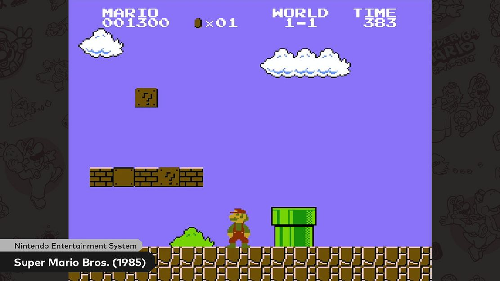
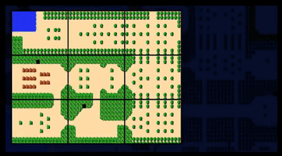
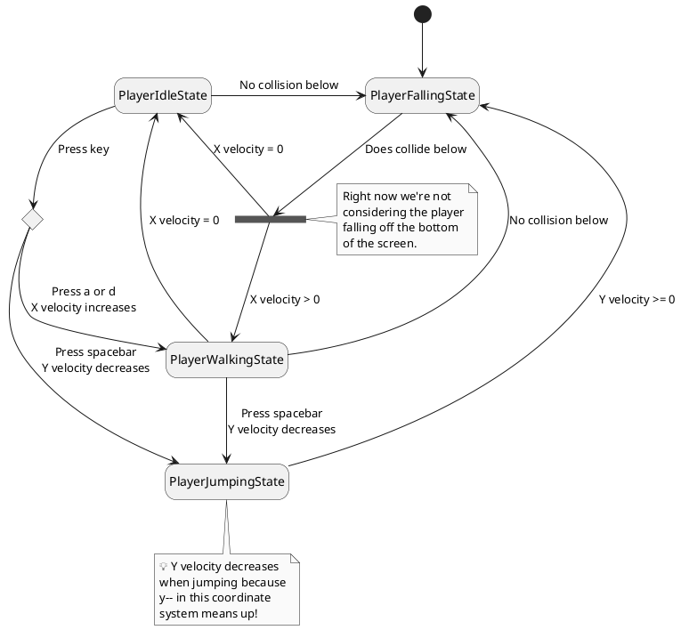
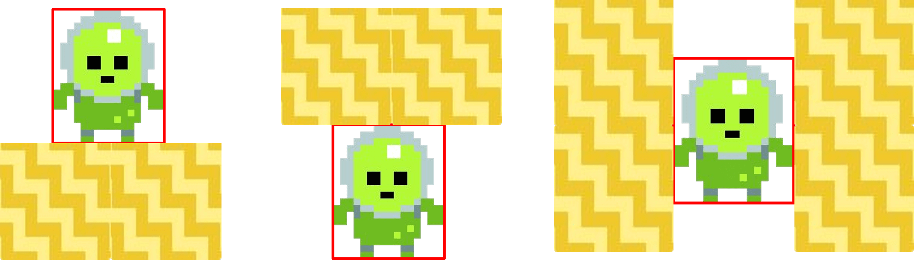
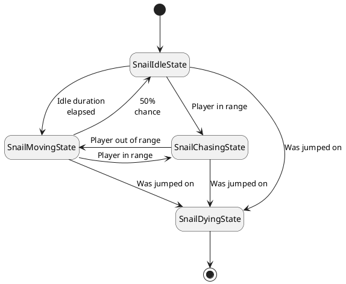

# 🏃‍♂️ Mario

## 🎯 Objectives

- **Tilemaps**: Create an entire game world from a simple 2D array.
- **Cameras**: Implement a camera that follows the player character around in the world.
- **2D Animation**: Enable sprites to appear like they're walking, sliding, jumping, etc.
- **Procedural Level Generation**: Generate our levels randomly so that we're not limited to a finite set of levels we would've created by hand.
- **Platformer Physics**: Implement basic platformer physics so that we don't have to iterate through our entire world to determine collisions.
- **Game Entities**: Program enemies to have their own decision-making abilities.
- **Game Objects**: Interact with various objects in the world like blocks and coins.

Super Mario Bros. was instrumental in the resurgence of video games in the mid-80s, following the infamous crash shortly after the Atari age of the late 70s. The goal is to navigate various levels from a side perspective, where jumping onto enemies inflicts damage and jumping up into blocks typically breaks them or reveals a power-up.



_Image from [Nintendo](https://mario.nintendo.com/history/)_

## 🔨 Setup

1. Clone the repo (or download the zip) for today's lecture, which you can find [here](https://github.com/JAC-CS-Game-Programming-Fall22/3-Mario).
2. Open the repo in Visual Studio Code.
3. Start Visual Studio Code's "Live Server" extension. If you don't have it installed:
   1. Click on the extensions icons in the left-hand side navigation.
   2. Search for "Live Server".
   3. Click install next to the extension by "Ritwick Dey". You may have to reload the window.

      

   4. Once it's installed, click "Go Live" on the bottom right of the window. This should start the server and automatically open a new tab in your browser at `http://127.0.0.1:5500/` (or whatever port it says on your machine).
      - The files the server serves will be relative to the directory you had open in VSC when you hit "Go Live".

## 🌅 Mario-0 (The "Day-0" Update)

Mario-0 generates a simple tilemap comprised of transparent _sky_ tiles and textured _ground_ tiles.

### Tilemaps

- A tilemap can be thought of as a large 2D array of squares where each square (tile) represents a small section of the entire map.
- It can be a little more complicated, of course, since some tiles represent sections that are solid and others represent tiles that are not. This determines whether or not a player can collide with a certain tile, which will obviously be very relevant to Mario.
- In Mario, each level is comprised of many small tiles that give the appearance of some larger whole.
- Tilemap tiles often have an ID of some kind to differentiate their appearance or behavior.

### Important Code

- `src/objects/Tile.js`: Represents one tile object in the tilemap and on the screen.
- `src/objects/Tilemap.js`: Contains all the tiles objects that comprise the map. This can be thought of as the board in Match 3.
- `src/services/LevelMaker.js`: The class which will actually build the tilemap for us.
- In `src/states/PlayState.js`, we call `LevelMaker.generateLevel()` that will loop through the dimensions of the map we set as static constants in `LevelMaker.js` and create a 2D array of `Tile` objects:

  ```javascript
  static generateLevel(width, height) {
      const tiles = [];
      const sprites = LevelMaker.generateSprites();

      for (let i = 0; i < height; i++) {
          tiles.push([]);
      }

      for (let x = 0; x < width; x++) {
          for (let y = 0; y < height; y++) {
              const tileType = y < LevelMaker.GROUND_HEIGHT ? TileType.Sky : TileType.Ground;

              tiles[y].push(new Tile(x, y, tileType, sprites));
          }
      }

      return new TileMap(width, height, tiles);
  }
  ```

  - Note the use of `TileType` to denote which tile sprite each tile object should render.
    - It might seem like our sprite sheet contains just one sprite (the tile that is visible in `assets/images/tiles.png`), but it also contains an additional sprite of the same tile, but transparent.

## 🎥 Mario-1 (The "Camera" Update)

Mario-1 looks the same as Mario-0, but allows the user to shift the map from left to right using `a` and `d`.

### Cameras

In games that take place in a large 2D/3D space, we cannot hope to show the player everything in the world/level for a number of reasons. For example, if you tried to cram everything in the world into one canvas, everything would be too miniscule to see properly. Or, maybe you want the player to complete some sort of puzzle or challenge and being able to see everything in the world would give the player the answer right away.

The idea of a "camera" is to only show the player one subsection of the world at any given moment. As they move their character in the world, the camera moves with them to reveal other parts of the world that were previously unseen.



If you're interested in learning more about cameras, here are two informative videos for you to watch depending on your level of curiosty:

- [2D Game Cameras by Luis Zuno (5:52)](https://www.youtube.com/watch?v=l9G6MNhfV7M&t)
- [How Cameras in Side-Scrollers Work by Itay Keren (52:34)](https://www.youtube.com/watch?v=pdvCO97jOQk)

> 💡 Watching these videos is by no means mandatory! However, if you do decide to watch even the first one, it will hopefully give you a bigger appreciation and perspective for what we're going to do in this lecture.

### Important Functions

- [`context.translate(x, y)`](https://developer.mozilla.org/en-US/docs/Web/API/CanvasRenderingContext2D/translate)
  - Shifts the coordinate system by `x` and `y`. This comes in handy for simulating camera behavior.

### Important Code

- There's a new `Camera.js` library class whose purpose for now is to keep track whenever the user presses `a` or `d`:

  ```javascript
  if (keys.a) {
      this.position.x -= Math.floor(this.speed * dt);
  }
  else if (keys.d) {
      this.position.x += Math.floor(this.speed * dt);
  }
  ```

  - We make sure to round down our camera position using `Math.floor()` in order to prevent any weird blurring or other such visual effects that might result when trying to draw things at floating-point coordinates.

- Then, in `PlayState::render()`, we have to translate the map in the opposite direction as the camera, since the map needs to move to the left when the user scrolls to the right, and vice versa:

  ```javascript
  context.translate(-this.camera.position, 0);
  ```

## 🧍‍♂️ Mario-2 (The "Stationary Hero" Update)

Mario-2 behaves the same way as Mario-1, but with the addition of introducing a stationary character sprite that stands on the tiles.

### Important Code

- We've added a new sprite sheet into `assets/images/` whose location we simply added to `config.json` and updated `enums.js`, and that's all we had to do to add a new asset into the game!
- There's a new `Player.js` class that lives in the `src/entities/` folder. We'll learn what exactly constitutes an "entity" in game development terms later on in this lecture.
  - You should be comfortable with how to iterate through sprite sheets and extract all the locations of each individual sprite by now:

  ```javascript
  static generateSprites() {
      const sprites = [];

      for (let i = 0; i < Player.TOTAL_SPRITES; i++) {
          sprites.push(new Sprite(
              images.get(ImageName.Character),
              i * Player.WIDTH,
              0,
              Player.WIDTH,
              Player.HEIGHT,
          ));
      }

      return sprites;
  }
  ```

- The only other change is in `render()`, where we draw our character to the screen. For now, we're only rendering the first sprite in the array:

  ```javascript
  render() {
      this.sprites[0].render(this.x, this.y);
  }
  ```

## ⏩ Mario-3 (The "Moving Hero" Update)

Mario-3 allows our character sprite to move from left to right on the map. The camera is fixed on our character sprite, allowing the player to move the sprite while scrolling the camera. However, there is still no animation for the sprite, and the player can still scroll off the edge of the map.

### Important Code

- The main difference here is instead of updating the camera's position from the player's input, we update our character's position when the player presses `a` or `d`:

  ```javascript
  update(dt) {
      if (keys.a) {
          this.position.x -= Math.floor(this.speed * dt);
      }
      else if (keys.d) {
          this.position.x += Math.floor(this.speed * dt);
      }
  }
  ```

- Now we simply update the camera's position to track the character's `x` position, making sure to center it on the screen as well:

  ```javascript
  getNewPosition() {
      return Math.floor(this.subject.position.x - (this.viewport.x / 2) + (this.subject.dimensions.x / 2));
  }
  ```

## 🏃‍♂️ Mario-4 (The "Animated Hero" Update)

Mario-4 behaves the same way as Mario-3 but with the added feature of animating our sprite's movement. Animations can be achieved by simply displaying a series of frames from a sprite sheet one after the other, akin to a flip book.

### Important Code

- `Animation.js` will take care of handling animations for our program. The `constructor()` takes in arguments that specify the number of frames in the animation as well as the interval between each frame:

  ```javascript
  constructor(frames, interval = 1) {
      this.frames = frames;
      this.interval = interval;
      this.timer = new Timer();
      this.currentFrame = 0;

      this.startTimer();
  }
  ```

- This class makes use of the `Timer` class from Match 3 as a mechanism to loop through the animations frames at a certain interval:

  ```javascript
  startTimer() {
      this.timer.addTask(() => {
          this.currentFrame = (this.currentFrame + 1) % this.frames.length;
      }, this.interval);
  }
  ```

- `Animation::getCurrentFrame()` returns the current frame for the animation. Back in `Player::constructor()` is where we actually instantiate our animations and set our sprite's direction:

  ```javascript
  this.idleAnimation = new Animation([0]);
  this.movingAnimation = new Animation([9, 10], 0.2);
  this.jumpAnimation = new Animation([2]);
  this.currentAnimation = this.idleAnimation;
  ```

- `Player::handleMovement()` takes care of toggling the moving animations when the player moves the character and setting the animation back to idle when the player is not moving the character. There's too much code to paste here, so please make sure you take a look at those this function and understand how the character sprite is being controlled and animated.

- When the player hits the spacebar, `Player::handleJump()` takes care of doing the actual jump logic as well as handling the correct animations for when the character sprite is jumping and when the character sprite eventually hits the ground again. This function also enforces that the character can only jump if they are on the ground (i.e. no double jumps mid-air). Again, please make sure you take a look at those this function and understand how the character sprite is being controlled and animated.

- `Player::handleJump()` sets the character's vertical velocity to zero once the sprite hits the floor since we haven't implemented tile collision yet. This implementation is a bit hacky, but it works for now:

  ```javascript
  if (this.position.y > this.groundHeight) {
      this.position.y = this.groundHeight;
      this.velocity.y = 0;
      this.currentAnimation = this.idleAnimation;
  }
  ```

## 🤖 Mario-5 (The "Stateful Hero" Update)

Mario-5 introduces a new state machine that will control the player's state. Right now, the `Player` class is doing a lot of checks to determine if the player is currently moving, jumping, falling, and idle. We'll make this design significantly more scalable by making use of a new state machine.

### Important Code

- The `states/` folder has been split into `states/entity/` and `states/game/` to accommodate the following new states:
  - `PlayerIdleState`: The player is stationary unless left or right are pressed, or if there is no collision below.
  - `PlayerWalkingState`: The player is on the ground and moving either left or right. From here, the player can go idle if nothing is being pressed and there is no X velocity. The player can fall if there is no collisions below them, and they can jump if they hit spacebar.
  - `PlayerJumpingState`: The player gets a sudden vertical boost. Once their Y velocity reaches 0, they start to fall.
  - `PlayerFallingState`: The player is travelling down towards the ground. Once they hit the ground, they are either idle if X velocity is zero, or walking if left or right are being pressed.

- For now, the main responsibility of each state is to take care of its own animation cycle. We actually have way more code than is necessary and you might be thinking, "why did we split what was once a nice neat package into way more files?". If you are thinking that, then trust me when I say that these states will come in handy later when we have increasingly more specific logic to execute depending on what the character is currently doing.

> 💡 It's important to recognize there are two separate things that happen when the player hits the spacebar: **jumping** and **falling**. In Mario, for example, you can destroy a block by hitting it while you jump, which you can't do by merely falling on it. Similarly, you can kill an enemy by falling on its head, but not by jumping towards it.

### State Diagram

Here's how the player will behave in the coming updates:



## 🏞️ Mario-6 (The "Level" Update)

Mario-6 allows the tile configuration of the map to be randomly generated each time the page is refreshed. Each tile configuration consists of a "topper set" and a "tile set", where the topper is a distinct color from the tileset and denotes the topmost surface of the tiles. We're also generating pillars and chasms at random to give the map some visual variability as well as giving the player something to jump on/avoid as per classic platforming games.

### Important Code

- Take a look at `assets/images/tiles.png` and `assets/images/toppers.png` whose location and dimensions were added to `config.json`.
  - In `enums.js` we've added a new enum for the toppers sprite sheet. The `TileType` enum has also been modified to reference the empty and ground tiles in the tiles sprite sheet.
  - In `LevelMaker.js` we've added many new static constants for the sprite sheet sections and dimensions.
- In `LevelMaker`, we're still using the same `generateSprites()` function to extract all the tiles and toppers since they're all conveniently 16x16 each.
- In `LevelMaker::generateLevel()`, you'll see the the function is doing more than simply generating one solid rectangular chunk of ground tiles:
  1. Randomly pick a set of toppers and tiles using the width and height constants for each sheet respectively.

      ```javascript
      const tileSet = getRandomPositiveInteger(0, LevelMaker.TILE_SETS_WIDTH * LevelMaker.TILE_SET_HEIGHT - 1);
      const topperSet = getRandomPositiveInteger(0, LevelMaker.TOPPER_SETS_WIDTH * LevelMaker.TOPPER_SETS_HEIGHT - 1);
      ```

  2. Initialize the tile map with empty arrays:

      ```javascript
      for (let i = 0; i < height; i++) {
          tiles.push([]);
      }
      ```

  3. Loop through the tile map column by column. We chose this method instead of row by row since it's easier to generate pillars and chasms per column. For each column in the tile map:
     1. Fill the column with "empty" tiles from the top of the map until `GROUND_HEIGHT`. Make no mistake, these are still `Tile` objects, it's just that their texture is fully transparent.

        ```javascript
        for (let y = 0; y < LevelMaker.GROUND_HEIGHT; y++) {
            tiles[y].push(new Tile(x, y, TileType.Empty, false, tileSet, topperSet));
        }
        ```

     2. Use a random number to decide if a chasm should be generated. If so, it will set `chasmCounter` to a random number. Starting from the next column, `chasmCounter` will not be zero, so then fill the rest of the column with "empty" tiles:

        ```javascript
        if (chasmCounter !== 0) {
            for (let y = LevelMaker.GROUND_HEIGHT; y < height; y++) {
                tiles[y].push(new Tile(x, y, TileType.Empty, false, tileSet, topperSet));
            }

            chasmCounter--;
        }
        else if (didSucceedChance(LevelMaker.CHASM_CHANCE)) {
            chasmCounter = getRandomPositiveInteger(LevelMaker.MIN_CHASM_WIDTH, LevelMaker.MAX_CHASM_WIDTH);
        }

        return chasmCounter;
        ```

        - `didSucceedChance(x)` is a new function inside `lib/RandomNumberHelpers.js` that will take care of returning `true` `x` percent of the time. `x` is denoted as a decimal number from 0 (0%) to 1 (100%).

     3. If the column was not determined to be a chasm, then generate the "ground" tiles for that column. Again, use a random number to determine how high the ground should be (i.e. generate a pillar or not):

        ```javascript
        const isPillar = didSucceedChance(LevelMaker.PILLAR_CHANCE);
        const pillarHeight = getRandomPositiveInteger(LevelMaker.GROUND_HEIGHT, LevelMaker.MAX_PILLAR_HEIGHT);
        const columnStart = isPillar ? pillarHeight : LevelMaker.GROUND_HEIGHT;

        for (let y = columnStart; y < height; y++) {
            tiles[y][x] = new Tile(x, y, TileType.Ground, y === columnStart, tileSet, topperSet);
        }
        ```

  4. Finally, generate the tile and topper sprites from the sprite sheet and pass them in to a newly instantiated `Tilemap` object:

      ```javascript
      const tileSets = LevelMaker.generateSprites(images.get(ImageName.Tiles), ...);
      const topperSets = LevelMaker.generateSprites(images.get(ImageName.Toppers), ...);

      return new Tilemap(..., tiles, tileSets, topperSets);
      ```

## 🎯 Mario-7 (The "Collision" Update)

Since the height that the player can stand on is variable now because we're generating pillars, we cannot continue to simply check:

```javascript
// PlayerFallingState.js (Mario-6)
if (this.player.position.y > this.player.groundHeight) {
    this.player.position.y = this.player.groundHeight;
}
```

We need a more sophisticated method of collision detection. 🤔

### Tile Collision

AABB is useful for detecting collision between two **moving** entities, but we can take advantage of our **static** 2D tilemap array and calculate whether the pixels in the direction we're traveling are solid, saving us computing time.



1. When checking for a collision below the player, we grab the two tiles they can be standing on. Statistically speaking, the player is rarely going to be above only one tile, so we always grab both anyway. In the event that the player is only above one tile, then the same tile will be returned to us when we do our check.

2. When checking for a collision above the character, it's the same logic as above, but instead we grab the two tiles the player can potentially be below.

3. When checking for a collision to the sides of a player, we grab either the top left and bottom left tiles for a left check, or the top right and bottom right tiles for a right check.

### Important Code

- In `Tilemap.js`:

  ```javascript
  pointToTile(x, y) {
      if (x < 0 ||
          x > this.canvasDimensions.x ||
          y < 0 ||
          y > this.canvasDimensions.y) {
          return null;
      }

    return this.tiles[Math.floor(y / TILE_SIZE)][Math.floor(x / TILE_SIZE)];
  }
  ```

- The first part of this function ensures that we don't return an error if we somehow go beyond the boundaries of the map.
- The second part of this function returns the tile in our tiles array that corresponds with the x and y coordinates in our map so that we can check if it is solid or empty.
- In terms of performance, this is notably better than having to iterate over all tiles in our array to check AABB. Again, this only works because the tiles are static. If we had, say, moving platforms, then we would probably have to go back to using AABB for those platforms.
- We can improve performance even further by only checking for collisions:
  - Above us when in jumping state:
    - `PlayerJumpingState::isTileCollisionAbove()`
  - Below us when in walking, falling, and idle states:
    - `PlayerWalkingState::isTileCollisionBelow()`
    - `PlayerIdleState::isTileCollisionBelow()`
      - Right now there's no need to check this since when the player is idle, it means they're probably on the ground. If we later decide to have moving platforms or some kind of wind force that could push the player while idle, then this becomes necessary.
    - `PlayerFallingState::isTileCollisionBelowLeft()` and `PlayerFallingState::isTileCollisionBelowRight()`
      - The reason this is split up into two difference functions is because if it were the same implementation as `PlayerWalkingState::isTileCollisionBelow()` or `PlayerIdleState::isTileCollisionBelow()`, the player would be able to get "stuck" on walls in mid-air when falling due to how the logic is implemented.
  - Beside us when in all states:
    - `Player::checkLeftCollisions()` and `Player::checkRightCollisions()`
      - At first, it might make sense to stick these calls in `Player::update()` since they're happening for all states. Upon closer inspection, please notices that these get called in different ways depending on the state.

  as opposed to checking for collisions in all directions in all states!

- The above functions utilize other functions in `Player.js`:
  - `getTilesByDirection(tileDirections)`: Returns all tiles in the specified directions relative to this entity.
  - `didCollideWithTiles(tileDirections)`: Returns whether this entity collided with any (not all) of the tiles in the specified directions.
  - `getCollisionTilesByDirection(tileDirections)`: Returns all tiles that the entity collided with in the specified directions.
    - In this function, after grabbing the tiles we want to check, we then see if that particular `Tile::isCollidable()`:

      ```javascript
      isCollidable() {
          return Tile.COLLIDABLE_TILES.some((tile) => tile === this.id);
      }
      ```

      This function simply checks if the `id` of that particular tile is in the array of `COLLIDABLE_TILES` that is defined statically in `Tile.js`.

## 🐌 Mario-8 (The "Enemy" Update)

Mario-8 adds a new _entity_ to the game: snails! The term _"entity"_ is the generic term that encapsulates anything in the game that moves around or has some sort of behaviour.

### Entities

- Entities can contain states just like the game, with their own `StateMachine`. States can affect input handling (for the player) or decision-making (for the snail).
- Collision between entities is done using AABB collision detection.
- Entities in this game (`Snail` and `Player`) represent the living things in our world, but could generally represent almost anything that has its own behaviour or states.

### State Diagram



### Important Code

- First, there's a new `src/Entities/Entity.js` class that all the entities in the game should extend. Inside, you will find methods to update, render, and detect collisions.
  - Notice that `Player.js` now extends this class.
- There's a new `Snail.js` class that extends `Entity` just like `Player` does.
  - The snail is an enemy that can kill the player on contact. It has decision-making abilities that allow it to move around in the level and chase the player if the player gets within range.
  - Just like `Player`, this class also has its own `StateMachine` with the following states:
    - `SnailMovingState`: The snail moves at a slower speed and can randomly decide to go idle or change directions.
    - `SnailIdleState`: The snail does not move and goes in its shell for a random period of time.
    - `SnailChasingState`: The snail follows the player at a higher move speed and animation speed.
    - `SnailDyingState`: The snail disappears and generates an array of particles as its death animation.

- There's also a new `src/objects/Level.js` class which acts as a container for the tilemap and now all of our entities. It is responsible for:
  - Updating the global `timer` object;
  - Filtering the array of entities so that any dead entities are removed;
  - Updating and rendering the tilemap and all of the entities.
- The player can kill the snail and vice versa. To detect collisions between entities, we can use AABB collision detection:

  ```javascript
  // Entity.js
  didCollideWithEntity(entity) {
      return (this.position.x + this.dimensions.x >= entity.position.x
          && this.position.x <= entity.position.x + entity.dimensions.x
          && this.position.y + this.dimensions.y >= entity.position.y
          && this.position.y <= entity.position.y + entity.dimensions.y);
  }
  ```

- To detect collisions between the player and other entities, we've added 2 functions to `Player.js`:
  - `checkEntityCollisions(onCollision)`: Loops through all the entities in the current level and checks if the player collided with any of them. If so, run `onCollision()`.
  - `onEntityCollision(object)`: Check if we've collided with any entities and die if so. This function is the default value for `checkEntityCollisions()`'s first argument if none were passed in.
- `checkEntityCollisions()` is called in all of the player states.

> 💡 In particular, `PlayerFallingState` passes its own callback in that defines logic to kill the snail instead of the player upon a collision.

## 💰 Mario-9 (The "Coin" Update)

Mario-9 adds 3 new _game objects_ to the game: blocks, bushes, and coins! The term _"game object"_ is the generic term that encapsulates anything in the game that is _solid_, _collidable_, or _consumable_.

### Game Objects

- Game objects are separate from the tiles in our map, for things that maybe don't align perfectly with it.For example, maybe they have different widths/heights or their positions are offset by a different amount than `TILE_SIZE`.
- Game objects can be tested for collision with AABB.
- For example, power-ups in Mario can be represented as game objects:
  - ⭐ A star game object may flip an `isInvincible` flag on the player and begin an `invincibilityDuration` timer.
  - 🍄 A mushroom game object may flip an `isBig` flag on the player that alters their `position`, `dimensions`, and swaps the sprite for a bigger/taller sprite.
  - 🌼 A flower game object may allow the player to shoot fireballs (could also be game objects) at enemies to kill them.

Here are the objects our game has so far:

|              | 📦 Block | 🌳 Bush  | 💰 Coin  |
| ------------ | :-----: | :-----: | :-----: |
| 🗻 Solid      | `true`  | `false` | `false` |
| 🎯 Collidable | `true`  | `false` | `true`  |
| 🍴 Consumable | `false` | `false` | `true`  |

- **Solid**: Entities cannot overlap the object.
- **Collidable**: Entities can overlap the object.
- **Consumable**: The object will disappear after an entity collides with it.

### Important Code

- If you look in `src/objects/` you will find 4 new files:
  - `GameObject.js`: The class that all the game objects in this folder should extend. Inside, you will find methods to update, render, and detect collisions.
  - `Block.js`: A"box" that the player can hit from beneath to reveal a coin.
  - `Bush.js`: A background asset that does not have any behaviour. It's simply for aesthetics.
  - `Coin.js`: A collectible item that the player can consume to gain points.
- `LevelMaker` is where the game objects are spawned during level creation:

  ```javascript
      if (didSucceedChance(LevelMaker.BUSH_CHANCE)) {
          objects.push(new Bush(
              new Vector(Bush.WIDTH, Bush.HEIGHT),
              new Vector(x * Tile.SIZE, y * Tile.SIZE),
          ));
      }

      if (didSucceedChance(LevelMaker.BLOCK_CHANCE)) {
          objects.push(new Block(
              new Vector(Block.WIDTH, Block.HEIGHT),
              new Vector(x * Tile.SIZE, y * Tile.SIZE),
          ));
      }
  ```

- To detect collisions between the player and the game objects, we've added 2 functions to `Player.js`:
  - `checkObjectCollisions(onCollision)`: Loops through all the game objects in the current level and checks if the player collided with any of them. If so, run `onCollision()`.
  - `onObjectCollision(object)`: Returns all solid and collidable game objects that were collided with. It also fires `object.onConsume()` if the game object is consumable. This function is the default value for `checkObjectCollisions()`'s first argument if none were passed in.
- These new collision functions are called in all of the player state classes as well as in `Player::checkLeftCollisions()` and `Player::checkRightCollisions()`.

And with that, we have a fully functioning game of Mario!

## 📚 References

- [Harvard's CS50 Introduction to Game Development - Mario](https://cs50.harvard.edu/games/2018/notes/4/)
