# 🐦 Angry Birds

## 🎯 Objectives

- **Physics Engines**: There's no way that we can hope to implement advanced physics ourselves (well not me at least, maybe you can!) so we'll be looking at how to use an already existing library ([Matter.js](https://brm.io/matter-js)) to do this work for us.

Released by [Rovio](https://www.rovio.com/) in 2009, [Angry Birds](https://www.angrybirds.com/) took the mobile gaming scene by storm back when it was still arguably in its infancy. Using the simple gameplay mechanic of slingshotting birds into fortresses of various materials housing targeted pigs, Angry Birds succeeded with its optimized formula for on-the-go gameplay. It's an excellent showcase of the ubiquitous Box2D physics library, the most widely used physics library of its kind, which is also open source.

This "clone" of Angry Birds doesn't contain nearly the plethora of features as the original series of games it's based on but does use [Matter.js](https://brm.io/matter-js) to showcase the fundamental setup of what the game looks like and how to use a subset of the physics library's features.

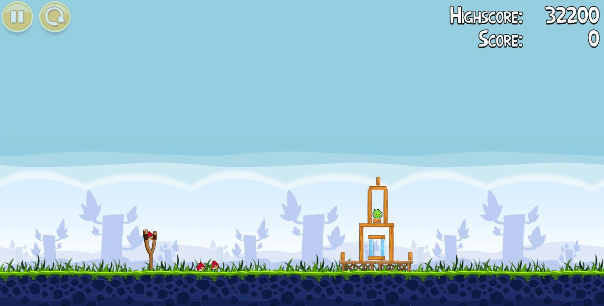

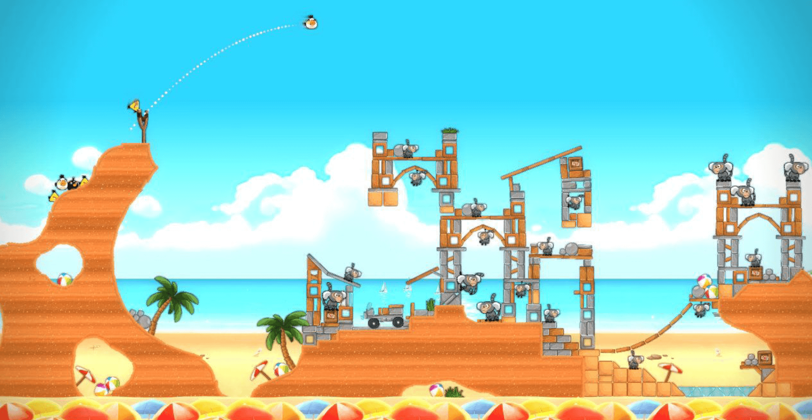

## 🔨 Setup

1. Clone the repo (or download the zip) for today's lecture, which you can find [here](https://github.com/JAC-CS-Game-Programming-Fall22/5-Angry-Birds).
2. Open the repo in Visual Studio Code.
3. Start Visual Studio Code's "Live Server" extension. If you don't have it installed:
   1. Click on the extensions icons in the left-hand side navigation.
   2. Search for "Live Server".
   3. Click install next to the extension by "Ritwick Dey". You may have to reload the window.

      

   4. Once it's installed, click "Go Live" on the bottom right of the window. This should start the server and automatically open a new tab in your browser at `http://127.0.0.1:5500/` (or whatever port it says on your machine).
      - The files the server serves will be relative to the directory you had open in VSC when you hit "Go Live".

## 🌅 Angry-Birds-0 (The "Day-0" Update)

### Physics Engines

So far in the course, we've implemented our own simple physics as it's been needed. We've been able to get away with it until now because all collisions we've had to check were all with non-rotated rectangles (i.e. **A**xis **A**ligned **B**ounding **B**oxes). Collision detection becomes **much more difficult** when checking between shapes of all different shapes/sizes/rotations. Instead of doing all this complicated math ourselves, we're going to outsource this work to an engine.


_Image from [ResearchGate](https://www.researchgate.net/figure/Bounding-volumes-sphere-axis-aligned-bounding-box-AABB-oriented-bounding-box_fig9_272093426)_

Angry Birds was originally created using the [open-source](https://github.com/erincatto/Box2D) physics engine [Box2D](https://box2d.org/) written in C++. Box2D is a ubiquitous engine in the game development community - even Unity uses it under the hood! Box2D has been ported to almost every well known programming language including JavaScript. However, **we will not be using it** for this course because the learning curve is rather steep and the JS ports are not documented very well.

### Matter.js

Instead, we'll be using a native JS engine called [Matter.js](https://brm.io/matter-js). Not only is it much easier to understand, but the documentation is also excellent.

> 📕 Thorough documentation is something one must always consider when choosing a new library to use for a project.

It's not mandatory, but if you want a fantastic comprehensive introduction to Matter.js, please watch [these videos](https://www.youtube.com/playlist?list=PLRqwX-V7Uu6bLh3T_4wtrmVHOrOEM1ig_) by [The Coding Train](https://www.youtube.com/channel/UCvjgXvBlbQiydffZU7m1_aw)! Even just the [first video](https://www.youtube.com/watch?v=urR596FsU68&list=PLRqwX-V7Uu6bLh3T_4wtrmVHOrOEM1ig_&index=1) in the playlist will give you a much better understanding of [Matter.js](https://brm.io/matter-js) and how to start using it.

In fact, [The Coding Train](https://www.youtube.com/channel/UCvjgXvBlbQiydffZU7m1_aw) did an entire coding challenge [video](https://www.youtube.com/watch?v=TDQzoe9nslY) about making Angry Birds with [Matter.js](https://brm.io/matter-js) and [p5.js](https://p5js.org/) which was used as the basis for this clone.

### Important Functions

#### Engine

The `Matter.Engine` module contains methods for creating and manipulating engines. An engine is a controller that manages updating the simulation of the world.

- [`Engine.create()`](https://brm.io/matter-js/docs/classes/Engine.html#method_create): Creates a new engine. The options parameter is an object that specifies any properties you wish to override the defaults. All properties have default values, and many are pre-calculated automatically based on other properties.
- [`engine.world`](https://brm.io/matter-js/docs/classes/Engine.html#property_world): The root `Matter.Composite` instance that will contain all bodies, constraints and other composites to be simulated by this engine.
- [`Engine.update(engine)`](https://brm.io/matter-js/docs/classes/Engine.html#method_update): Moves the simulation forward in time by `delta` ms. If no `delta` is provided, will default to `16.67` ms which equates to 60 frames per second.

#### Body

The `Matter.Body` module contains methods for creating and manipulating body models. A `Matter.Body` is a rigid body that can be simulated by a `Matter.Engine`. Factories for commonly used body configurations (such as rectangles, circles and other polygons) can be found in the module `Matter.Bodies`.

- [`Bodies.rectangle(x, y, width, height, [options])`](https://brm.io/matter-js/docs/classes/Bodies.html#method_rectangle): Creates a new rigid body model with a rectangle hull. The `options` parameter is an object that specifies any properties you wish to override the defaults.

#### Composite

A composite is a collection of `Matter.Body`, `Matter.Constraint` and other `Matter.Composite` objects. They are a container that can represent complex objects made of multiple parts, even if they are not physically connected. A composite could contain anything from a single body all the way up to a whole world.

- [`Composite.add(composite, body)`](https://brm.io/matter-js/docs/classes/Composite.html#method_add): Generic single or multi-add function. Adds a single or an array of body(s), constraint(s) or composite(s) to the given composite. Triggers `beforeAdd` and `afterAdd` events on the `composite`.
- [`Composite.allBodies(composite)`](https://brm.io/matter-js/docs/classes/Composite.html#method_allBodies): Returns all bodies in the given `composite`, including all bodies in its children, recursively.

### Important Code

- The first thing we have to do is add the `matter.js` library to our project. We'll add it where we've been adding all the library files for our games so far: the `./lib/` folder. Since Matter was not built using ES modules, we have to include it globally in our `./index.html`.

  ```html
  <!-- index.html -->
  <script src="./lib/Matter.js"></script>
  ```

- To try and "protect" our code from having a global `Matter` object (that comes from the `./lib/Matter.js` file), we can sort of "alias" it in our `globals.js`. Yes, this will still make the new `matter` (lowercase) object global to our app, but with the (small) protection of having to explicitly `import` the `matter` object before using it, instead of just calling `Matter` (uppercase) accidentally somewhere.

  ```javascript
  // globals.js
  export const matter = Matter;
  ```

  - Then, we can use `matter` to create the physics engine:

    ```javascript
    // globals.js
    export const engine = matter.Engine.create();
    ```

  - The `world` is the `Composite` object that will contain all the bodies and constraints in our game.

    ```javascript
    // globals.js
    export const world = engine.world;
    ```

- `./src/entities/GameEntity.js`: The base class that all entities in the game should extend.
  - Uses `Composite.add(world, body)` to add a new body to the Matter `world`. Once a body has been added, it is then able to be affected by physics.
- `./src/entities/Rectangle.js`: A `GameEntity` that has a Matter rectangle as its body.
  - Canvas represents retangles with the origin at the top-left, whereas Matter represents rectangles with the origin at the center center. We'll work in top-left coordinates as usual but offset them when giving/retrieving to/from Matter.
  - We can use the `body.position` attribute to draw the shapes on our canvas based on the Matter body's position in the Matter world:

    ```javascript
    renderOffset = { x: -width / 2, y: -height / 2 };
    context.translate(body.position.x, body.position.y);
    context.rect(renderOffset.x, renderOffset.y, width, height);
    ```

- `./src/entities/Ground.js`: The ground is a large Matter [static](https://brm.io/matter-js/docs/classes/Body.html#property_isStatic) body where everything in the world will sit upon.
  - A static body can never change position or angle and is completely fixed (as opposed to a dynamic body).

- `./src/states/PlayState.js`
  - Instantiate a `new Ground()` object.
  - Call `Engine.update(engine)` to move the Matter world forward by one timestep every time `PlayState::update()` is called. This is how we "sync" our canvas updates with the Matter world.
  - We can use `Composite.allBodies(world)` to get all Matter bodies currently in the world which will help us ensure that for every Matter body, we have a canvas `GameEntity` object. Right now, there's only one `GameEntity` object (`Ground`) so we should only see one Matter body displayed.

## 🐦 Angry-Birds-1 (The "Bird" Update)

In this update, we introduce circular dynamic bodies to represent the birds. You can press enter to spawn more birds and flood the screen. The purpose here is to demonstrate how dynamic bodies interact with static bodies (i.e. the ground) and with other dynamic bodies. Notice how the gravity, velocity, angular speed, etc. are all being updated by Matter in the canvas animation. Once a bird leaves the edge of the screen, they are despawned and cleaned up so that we only process entities that are currently on the screen.

### Important Functions

- [`Composite.remove(world, body)`](https://brm.io/matter-js/docs/classes/Composite.html#method_remove): Removes one or many body(s), constraint(s) or a composite(s) from the given `world` composite.
- The [`Matter.MouseConstraint`](https://brm.io/matter-js/docs/classes/MouseConstraint.html) module contains methods for creating mouse constraints. Mouse constraints are used for allowing user interaction, providing the ability to move bodies via the mouse or touch.
  - [`MouseConstraint.create()`](https://brm.io/matter-js/docs/classes/MouseConstraint.html#method_create): Creates a new mouse constraint.
  - [`Mouse.create(canvas)`](https://brm.io/matter-js/docs/classes/Mouse.html#method_create): Creates a mouse input. The `Matter.Mouse` module contains methods for creating and manipulating mouse inputs.

### Important Code

- `./src/entities/Bird.js`: A bird that will be launched at the pig fortress. The bird is a dynamic (i.e. non-static) Matter body meaning it is affected by the world's physics.
  - We've given the bird a high [restitution](https://brm.io/matter-js/docs/classes/Body.html#property_restitution) value so that it is bouncy.
- `./src/entities/Circle.js`: A `GameEntity` that has a Matter circle as its body.
  - `context.rotate(this.body.angle)` is used to rotate the canvas entity by the Matter body's angle value. We can see the circle entities rotating since we've drawn a line from the center of the circle out to the edge.
  - Both Canvas and Matter use the center of the circle for the origin so we don't have to worry about offsetting like we do for rectangles.
  - We're printing how many `Bird` entities there are as well as how many Matter bodies exist. They should be the same number because we're cleaning up both if they go off screen:

    ```javascript
    // Circle.js
    if (this.didGoOffScreen()) {
       this.shouldCleanUp = true;
    }

    didGoOffScreen() {
        return this.body.position.x + this.radius < 0 || this.body.position.x - this.radius > CANVAS_WIDTH;
    }

    // GameEntity.js
    if (this.shouldCleanUp) {
        Composite.remove(world, this.body);
    }

    // PlayState.js
    this.birds = this.birds.filter((bird) => !bird.shouldCleanUp);
    ```

- Notice that we have the ability to pick up the circles with our mouse. To achieve this, we're using Matter's built-in mouse constraint:

  ```javascript
  Composite.add(world, MouseConstraint.create(engine, {
      mouse: Mouse.create(canvas),
  }));
  ```

  - Once this constraint is added to the world, that's all we need to do to control Matter bodies with the mouse!

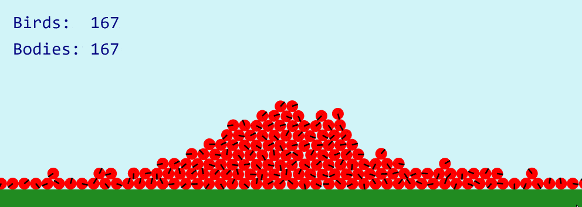

## 🏹 Angry-Birds-2 (The "Slingshot" Update)

This update places the bird inside of a slingshot mechanism such that the bird can be launched. We calculate the approximate trajectory that the bird will take if the player releases the mouse so that the player can aim their shot with more accuracy.

### Constraints

The Slingshot's mechanism is implemented by using a [Matter Constraint](https://brm.io/matter-js/docs/classes/Constraint.html) object. Constraints are used for specifying that a fixed distance must be maintained between two bodies (or a body and a fixed world-space position). The stiffness of constraints can be modified to create springs or elastic.

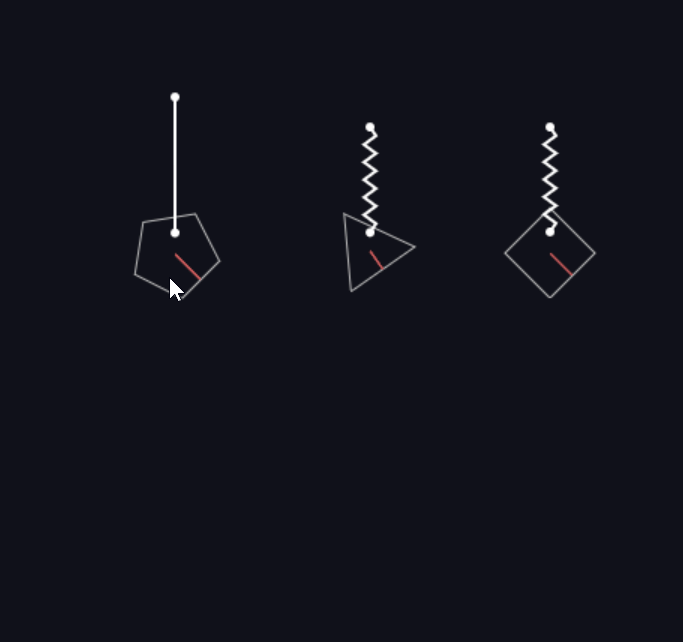

_You can play with this demo [here](https://brm.io/matter-js/demo/#constraints)_

A constraint is made up of 4 main parts:

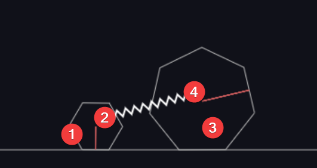

1. [`constraint.bodyA`](https://brm.io/matter-js/docs/classes/Constraint.html#property_bodyA): The first possible `Body` that this constraint is attached to.
2. [`constraint.pointA`](https://brm.io/matter-js/docs/classes/Constraint.html#property_pointA): A `Vector` that specifies the offset of the constraint from center of the `constraint.bodyA` if defined, otherwise a world-space position.
3. [`constraint.pointB`](https://brm.io/matter-js/docs/classes/Constraint.html#property_pointB): A `Vector` that specifies the offset of the constraint from center of the `constraint.bodyB` if defined, otherwise a world-space position.
4. [`constraint.bodyB`](https://brm.io/matter-js/docs/classes/Constraint.html#property_bodyB): The second possible `Body` that this constraint is attached to.

### Important Functions

- [`Constraint.create(options)`](https://brm.io/matter-js/docs/classes/Constraint.html#method_create): Creates a new constraint. To simulate a revolute constraint (or pin joint like for our slingshot) set `length: 0`.
- [`Body.setVelocity(body, vector)`](https://brm.io/matter-js/docs/classes/Body.html#method_setVelocity): Sets the linear velocity of the body instantly.
- [`Body.update(body, deltaTime, timeScale, correction)`](https://brm.io/matter-js/docs/classes/Body.html#method_update): Performs a simulation step for the given body, including updating position and angle using Verlet integration.
- [`Bodies.fromVertices(x, y, vertexSets, [options])`](https://brm.io/matter-js/docs/classes/Bodies.html#method_fromVertices): Utility to create a compound body based on set(s) of vertices.

### Important Code

- `./src/objects/Slingshot.js`
  - `Slingshot::initializeSling()`: Create the contraint between the point vector that represents the slingshot's location and the bird.
  - `Slingshot::isReadyToLaunch()`: Check if the mouse was released and if the bird is on the opposite side of the slingshot from where the mouse currently is.
  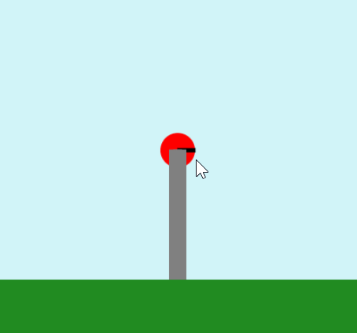
  - `Slingshot::launch()`: Sets the `bodyB` property of the constraint to `null` which has the effect of "releasing" the body from the contraint. The cool thing is that the body maintains whatever velocity it had at the time of release which causes the body to keep traveling on that trajectory!
  - `Slingshot::shouldUnload()`: Checks if the bird was launched, and if so, if the bird has stopped or gone off screen.
    - `Circle::didStop()`: Checks if the body's `angularSpeed` and `speed` are extremely low.
  - `Slingshot::calculateTrajectory()`: Calculates the white dots that help the player line up their shot. This is done by creating a dummy clone of the bird and running the Matter world simulation only on the cloned bird. We can then record the positions of the bird as it gets updated in its "mock flight" and use those points to render the white dots later.
    - `GameEntity::clone()`: To calculate the trajectory of the actual bird, we'll have to make a dummy version of the actual bird so that we can manipulate the dummy without affecting the actual.
- `./src/enums/BodyType.js`: To be able to identify different types of bodies in the Matter world, we can give them body labels. To make these labels more readable, we'll use an enum.
  - `GameEntity::isBodyOfType(body, type)`: Uses the `BodyType` enum to check if a certain `body` is of a certain `type`. In our case, we only want to calculate/render the trajectory if the current body being dragged is `BodyType.Bird`.
- `./src/enums/EventName.js`: Matter mouse constraints have [events](https://brm.io/matter-js/docs/classes/MouseConstraint.html#events) we can hook into to detect things like whether the mouse is being dragged which we'll need for our slingshot.

  ```javascript
  // Slingshot.js
  registerMouseEvents(mouseConstraint) {
      Events.on(mouseConstraint, EventName.MouseDragStart, (event) => {
          this.onMouseDragStart(event);
      });

      Events.on(mouseConstraint, EventName.MouseDragEnd, (event) => {
          this.onMouseDragEnd(event);
      });
  }
  ```

After all of that craziness, we can finally instantiate our slingshot!

```javascript
// PlayState.js
this.slingshot = new Slingshot();
```

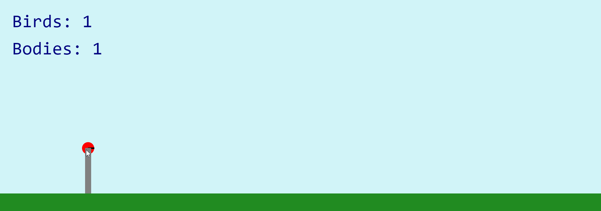

## 🎫 Angry-Birds-3 (The "Queue" Update)

In this update, we implement a queue of birds that are patiently waiting to be loaded one-by-one into the slingshot. Once a bird has been launched and has either come to a dead stop or has gone off the screen, then the next bird in the queue is loaded into the slingshot.

### Queue

A queue is an ordered list of elements where an element is inserted at the end of the queue and is removed from the front of the queue.

Unlike a stack, which works based on the last-in, first-out (LIFO) principle, a queue works based on the first-in, first-out (FIFO) principle.

A queue has two main operations involving inserting a new element and removing an existing element. The enqueue operation inserts an element at the end of the queue, whereas the dequeue operation removes an element from the front of a queue.


_Image from [JavaScriptTutorial](https://www.javascripttutorial.net/javascript-queue/)_

Another important operation of a queue is getting the element at the front called peek. Different from the dequeue operation, the peek operation just returns the element at the front without modifying the queue.

### Important Code

- `./src/objects/BirdQueue.js`: Uses the Queue data structure to keep an ordered array of birds. The order is relevant since the bird at the front of the queue is the one that gets loaded into the slingshot.
  - `BirdQueue::initializeQueue(birdTypes)`: Uses the passed-in array of `BirdType` enums to make calls to the `BirdFactory` and positions the birds up in a nice orderly line behind the slingshot. The bird at the front of the queue is placed at the slingshot's location.

    ```javascript
    initializeQueue(birdTypes) {
        birdTypes.forEach((type, index) => {
            const x = index === 0 ? Slingshot.LOCATION.x : Slingshot.LOCATION.x / birdTypes.length * (birdTypes.length - index);
            const y = index === 0 ? Slingshot.LOCATION.y : CANVAS_HEIGHT - Ground.MEASUREMENTS.height;

            this.enqueue(BirdFactory.createInstance(type, x, y));
        });
    }
    ```

- `./src/services/BirdFactory.js`: Just like in Zelda's `EnemyFactory`, we'll use the same design pattern to encapsulate the creation logic for the birds. As you can probably guess, you will probably have to add to this class for the assignment! 😉

  ```javascript
  static createInstance(type, x, y) {
      switch (type) {
          case BirdType.Red:
              return new Bird(x, y);
      }
  }
  ```

- `./src/enums/BirdType.js`: Right now only has `BirdType.Red`, but you'll have to add to this for different types of birds in the assignment. What's nice about this implementation is now we only have to pass in an array of types when instantiating the queue:

  ```javascript
  // PlayState.js
  this.birdQueue = new BirdQueue([
      BirdType.Red,
      BirdType.Red,
      BirdType.Red,
      BirdType.Red,
  ]);
  ```

- Then we can pass the queue to a `new Slingshot(birdQueue)` which will use `BirdQueue::dequeue()` to load birds into the sling whenever it needs:

  ```javascript
  // Slingshot.js
  constructor(birdQueue) {
      this.bird = birdQueue.dequeue();
  }

  if (this.shouldLoad()) {
      this.load(this.birdQueue.dequeue());
  }

  shouldLoad() {
      return this.isEmpty() && !this.birdQueue.areNoBirdsLeft();
  }
  ```

- All bodies in the Matter world are collidable with each other unless otherwise specified. Normally, this is the desired behaviour. However, in our context, it's rather annoying to have the birds be collidable with each other since they can knock each other out of the queue. To fix this, we can use [Matter's collision filtering](https://brm.io/matter-js/docs/classes/Body.html#property_collisionFilter):

  > If the two bodies have the **same non-zero value** of collisionFilter.group, they will **always collide if the value is positive**, and they will **never collide if the value is negative**.

  - This is one of the options we can pass when creating a new Matter body:

  ```javascript
  // Bird.js
  constructor(x, y) {
      super(x, y, Bird.RADIUS, 'red', {
          restitution: 0.8,
          label: BodyType.Bird,
          collisionFilter: {
              group: -1,
          },
      });
  }
  ```

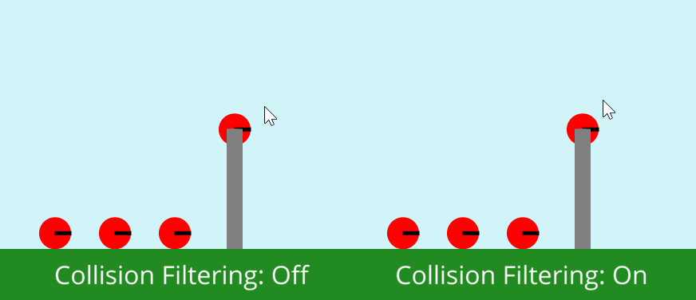

After all of that, we get this nice and orderly queue!

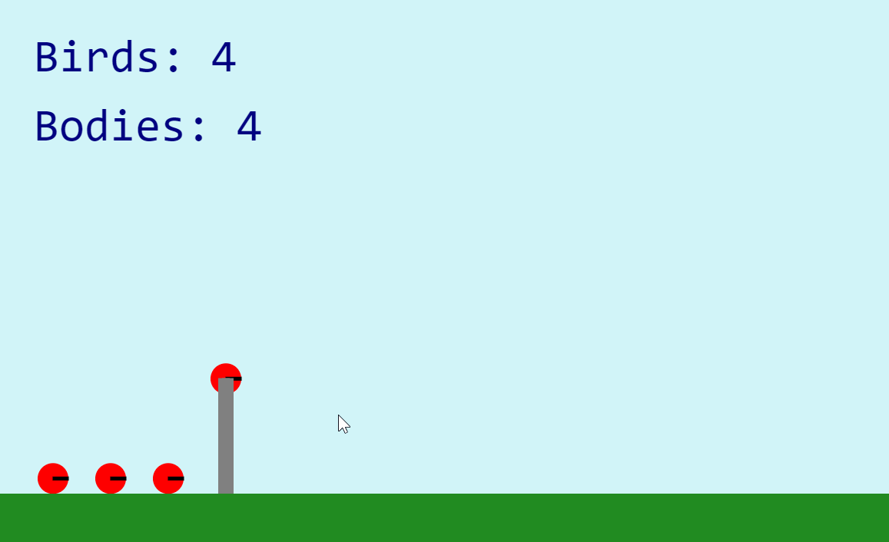

## 🧱 Angry-Birds-4 (The "Block" Update)

In this update, we introduce rectangular dynamic bodies to represent the blocks that comprise the pig fortress.

### Sleeping

- [`Sleeping.set(body, boolean)`](https://brm.io/matter-js/docs/classes/Sleeping.html): Sleeping bodies do not detect collisions or move when at rest. This is required so that the fortress' blocks don't constantly shake and move when nothing is happening.

  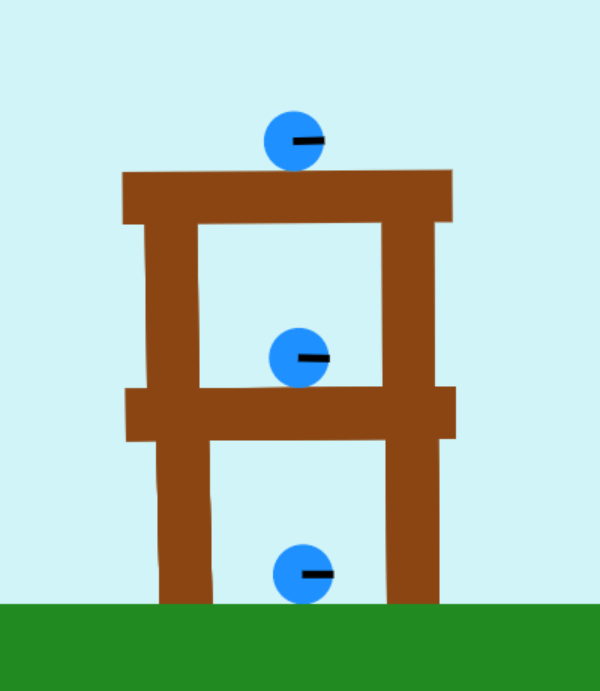

- We set the `enableSleeping` property when initializing the engine in:

  ```javascript
  // globals.js
  export const engine = matter.Engine.create({
      enableSleeping: true
  });
  ```

- Which will automatically turn off listening for collisions when bodies are at rest. However, we still need the bodies to listen for collisions when other body hit them, so we can temporarily wake them up like this:

  ```javascript
  // Fortress.js
  Composite.allBodies(world).forEach((body) => Sleeping.set(body, false));
  ```

- [Here's another demo](https://brm.io/matter-js/demo/#sleeping) showing sleeping bodies.

### Density

- [`Body.density`](https://brm.io/matter-js/docs/classes/Body.html#property_density): A number that defines the density of the body, that is its mass per unit area. If you pass the density via `Body.create` the `mass` property is automatically calculated for you based on the size (area) of the object. This is preferable rather than explicitly setting mass and allows for more intuitive definition of materials (e.g. rock has a higher density than wood). Given a rock body and a wood body that were the exact same size, the rock would be heavier than the wood. This property has a default value of `0.001`.
- `damageThreshold` is now a property added to the body in `GameEntity` which is calculated using the body's mass. We don't specify the mass directly - Matter calculates the mass of an object based on its size and `density` values.


> 💡 Tweaking the density values is where the developer/designer has to be very thoughtful. If the values are too high, then the game will be too hard since nothing will break. If the values are too low, the game will be too easy since everything will break by the slightest breeze. It's in these values that separates so-so games from fun games!

### Important Code

- `./src/entities/Block.js`: The building blocks (literally) that are used to build a pig fortress. The block is a dynamic (i.e. non-static, unlike `Ground` which is static) Matter body meaning it is affected by the world's physics. We've set the friction high to mimic a wood block which is not usually slippery.

  ```javascript
  constructor(x, y, size, angle = Block.ANGLE_VERTICAL) {
      super(x, y, Block.DIMENSIONS[size].width, Block.DIMENSIONS[size].height, 'saddlebrown', {
          angle: angle,
          label: BodyType.Block,
          isStatic: false,
          frictionStatic: 1,
          friction: 1
      });

      this.size = size;
  }
  ```

- `./src/objects/Fortress.js`: The container for the blocks that comprise the level. This class will check for any collisions, damage the appropriate blocks, and clean them up from the world.
  - `Fortress::registerCollisionEvents()`: Just like the `MouseConstraint` in `Slingshot` has events that we can hook into to know if the mouse was dragged, the Matter `Engine` also has [similar events](https://brm.io/matter-js/docs/classes/Engine.html#events) to detect if collisions between bodies occurred.
  - `Fortress::didFirstBodyDamageSecond(firstBody, secondBody)`: Given a pair of bodies, determines which body was damaged by which body using the `speed`,`mass`, and `damageThreshold` properties of the body.

    ```javascript
    didFirstBodyDamageSecond(firstBody, secondBody) {
        return firstBody.speed * firstBody.mass > secondBody.damageThreshold;
    }
    ```

  - Once we determine that a body was broken, then we flag it to be cleaned up by pushing that body into the `bodiesToRemove` array. `Fortress::removeBodies()` then iterates over that array and flags all the corresponding entities to be cleaned up.

- `./src/enums/EventType.js`: Now has Matter engine events names.
- `./src/enums/BodyType.js`: Now has an entry for `Block`.
- `./src/enums/Size.js`: A new enum used to differentiate between block sizes:

  ```javascript
  // Block.js
  static DIMENSIONS = {
      [Size.Small]: { width: 35, height: 70 },
      [Size.Medium]: { width: 35, height: 110 },
      [Size.Large]: { width: 35, height: 220 },
  };
  ```

- In `Rectangle::render()` we're now rotating the entity before drawing just like in `Circle` by calling `context.rotate(this.body.angle)`. This is important because our blocks can rotate as they interact with the Matter world!

- Finally, we can initialize an array of blocks and give it to a new instance of `Fortress`:

  ```javascript
  // PlayState.js
  const blocks = [
      new Block(
          startX + Block.DIMENSIONS[Size.Medium].width * 0.25,
          CANVAS_HEIGHT - Ground.MEASUREMENTS.height - Block.DIMENSIONS[Size.Medium].height,
          Size.Medium
      ),
      new Block(
          startX + Block.DIMENSIONS[Size.Medium].width * 4.75,
          CANVAS_HEIGHT - Ground.MEASUREMENTS.height - Block.DIMENSIONS[Size.Medium].height,
          Size.Medium
      ),
      new Block(
          startX + Block.DIMENSIONS[Size.Medium].width * 2.5,
          CANVAS_HEIGHT - Ground.MEASUREMENTS.height - Block.DIMENSIONS[Size.Medium].height * 2,
          Size.Large,
          Block.ANGLE_HORIZONTAL
      ),
  ];

  this.fortress = new Fortress(blocks);
  ```

## 🐷 Angry-Birds-5 (The "Pig" Update)

In this update, we introduce circular dynamic bodies to represent the pigs. If the player clears all the pigs in the level, they are taken to a `Victory State`. If they run out of birds and there are still pigs in the level, they are taken to a `GameOverState`.

### Important Code

- `./src/entities/Pig.js`: Exactly the same as `Bird` except for different `density` and `restitution` values. We have to make the pigs less dense than the birds so that the birds can damage them easier.
- `./src/objects/Fortress.js`: Add the pigs to the fortress in addition to the blocks.
- `./src/states/VictoryState.js` and `./src/states/GameOverState.js` have been added to display very simple screens to the player when they win or lose, respectively. The code for these states is self-explanatory so please have a quick look at those files.
- `./src/states/PlayState.js` has a couple of functions to check if the player has won or lost:

  ```javascript
  // PlayState.js
  didWin() {
      return this.fortress.areNoPigsLeft();
  }

  didLose() {
      return this.birdQueue.areNoBirdsLeft() && this.slingshot.isEmpty();
  }

  checkWinOrLose() {
      if (this.didWin()) {
          stateMachine.change(GameStateName.Victory);
      }
      else if (this.didLose()) {
          stateMachine.change(GameStateName.GameOver);
      }
  }
  ```

  - Before changing states if the player wins/loses, we take care to clean up the world of any bodies that might still be hanging around:

  ```javascript
  // PlayState.js
  exit() {
      Composite.allBodies(world).forEach((body) => Composite.remove(world, body));
  }
  ```

## ⏩ Angry-Birds-6 (The "Level" Update)

In this update, we add levels for the player to progress through.

### Important Code

- `./src/objects/Level.js`: We're taking most of the code from `PlayState` and encapsulating it in a new `Level` class. Now, all `PlayState` needs to do is update the level and check for a win/loss before changing state.
- `./src/services/LevelMaker.js`: Is the service class that will build the levels for us. Since the layout of the bricks/pigs can be extremely messy, it's nice to be able to encapsulate all that logic in a dedicated class.
  - Probably what would be even better is if we were able to read level configurations from a text/json file when bootstrapping the game in `main.js`, exactly like we're doing for the game's assets. This way, we could expose an "API" for the players of our game to add/modify their own levels.
  - `LevelMaker` is used in all 3 states to generate a new level based on if the player started a new game, won a level, or lost the game.

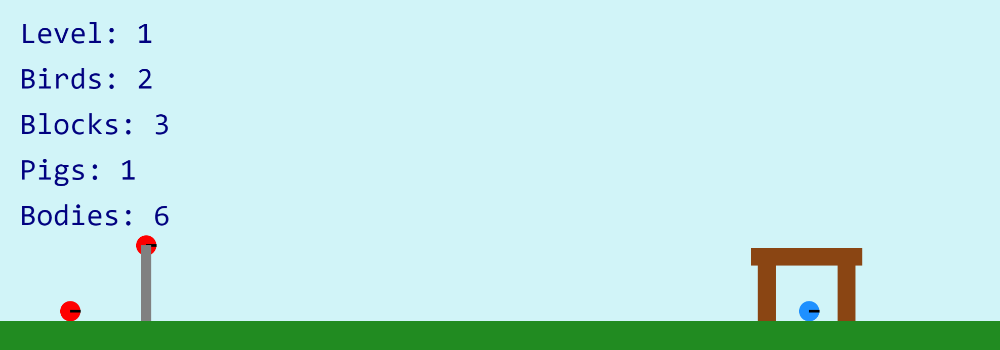

## ✨ Angry-Birds-7 (The "Polish" Update)

In this update, we add sprites, sounds, fonts, and a little behaviour for the birds to give them a bit more personality!

### Important Functions

- [`Body.applyForce(body, position, force)`](https://brm.io/matter-js/docs/classes/Body.html#method_applyForce): Applies a force to a body from a given world-space position, including resulting torque.
  - We use this in `Bird` to make the bird do a tiny jump from time to time.

### Important Code

- `Circle` and `Rectangle` now pass up their drawing code to `super.render()` to act as a debugger. In addition to the shapes being drawn, the stats from the previous update are also now behind this debug mode.
  - If you enable `DEBUG` in `globals.js`, you'll see what I mean.
- `./assets/`: You'll find sprites for the bird, pig, block, ground, background, slingshot, as well as the new fonts and sounds.
- `./config.json` has been added as usual to load all the new assets.
- The static `DIMENSIONS` property in our entities has now become `SPRITE_MEASUREMENTS` since we now need to keep track of where the sprites are in the sprite sheet.
  - The sprites are extracted in `GameEntity.generateSprites()`:

    ```javascript
    static generateSprites(measurements) {
        const sprites = [];

        measurements.forEach((measurement) => {
            sprites.push(new Sprite(
                images.get(ImageName.Sprites),
                measurement.x,
                measurement.y,
                measurement.width,
                measurement.height
            ));
        });

        return sprites;
    }
    ```

  - For example, this is how `Bird` gets its sprites:

    ```javascript
    // Bird.js
    static SPRITE_MEASUREMENTS = [
        { x: 903, y: 798, width: 45, height: 45 },
    ];

    this.sprites = GameEntity.generateSprites(Bird.SPRITE_MEASUREMENTS);
    ```

- `Bird::isWaiting` and `Bird::isJumping` are the two booleans that will control the little jump the bird does occasionally while waiting their turn in the queue.
  - The actual "jump" is not a tween - we're applying a tiny negative Y force to the bird:

    ```javascript
    // Bird.js
    jump() {
        matter.Body.applyForce(this.body, this.body.position, { x: 0.0, y: -0.2 });
    }
    ```

  - Make sure you understand how this function works since you'll have to **use it for the assignment**!

And with that, we have a fully functioning game of Angry Birds!

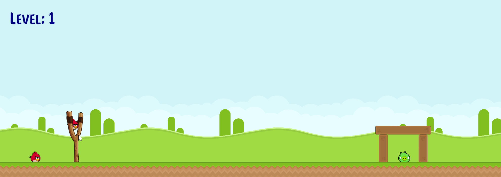

## 📚 References

- [Harvard's CS50 Introduction to Game Development - Angry Birds](https://cs50.harvard.edu/games/2018/notes/6/)
- [The Coding Train - Coding Challenge #138: Angry Birds with Matter.js](https://www.youtube.com/watch?v=TDQzoe9nslY)
